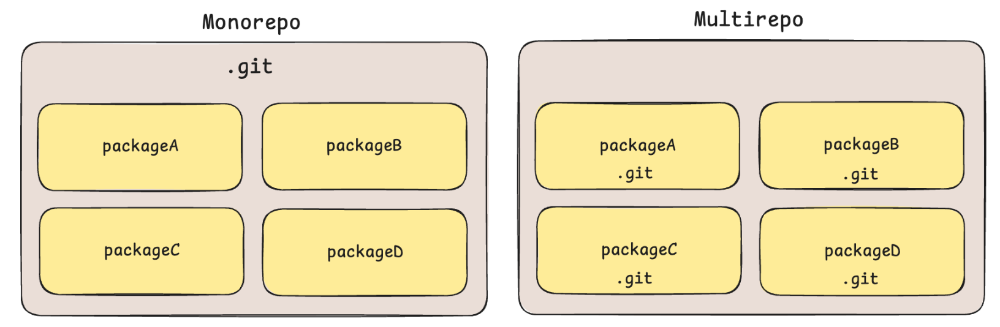
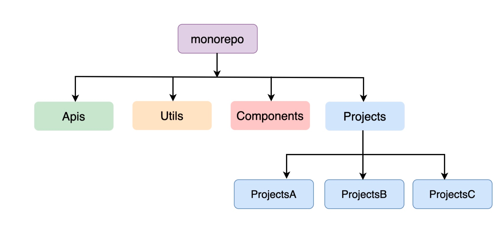

# Monorepo 与 Multirepo

也就是单仓管理与多仓管理。一个多包管理的项目，可以使用单仓管理，也可以使用多仓管理。

思考🤔：什么是包？

答案：被包管理器（npm、yarn、pnpm）初始化之后的目录，会存在一个包描述文件package.json，那么这样的目录就被称之为包。

思考🤔：什么是仓库？

答案：被版本控制系统（svn、git）初始化之后的目录，例如使用 git 进行初始化之后，会存在一个 .git 的目录。

在多包管理上面，常见的方案就是两种：

- 多仓管理（Multirepo）：一个包对应一个仓库，多个包对应多个仓库
- 单仓管理（Monorepo）：无论是一个包还是多个包，都对应**一个仓库**

## Monorepo

一个仓库一个项目的管理方式的弊端：

- 每个项目都要搭建 eslint + prettier + commitLint + styleLint 等代码规范校验
- 每个项目都要搭建许多类似的常用组件和创建公共 utils 函数
- 各个项目的主要依赖库（vue、elementPlus）版本可能不一致，且存在重复安装
- 有时候组件改动会涉及到多个项目都要手动更改

 Monorepo 可以让多个模块共享同一个仓库，因此他们可以共享同一套构建流程、代码规范也可以做到统一，特别是如果存在模块间有**共享**公共组件的情况，查看代码、修改 bug、调试等会更加方便。

1. 统一的依赖管理
2. 简化代码共享
3. 更容易进行跨项目更改
4. 更好的跨团队协作

很多知名的前端项目也采用 Monorepo 的方式来管理多个包的。

> **企业开发中使用Monorepo**

在企业开发中，如果你选择使用 Monorepo 来架构你的多个项目，那么通常是将公共的组件、工具库、api 等抽离出来进行共享，如下图所示：

> **Monorepo缺点**

- 代码库规模较大

- 缺乏独立版本控制

- 权限和安全性问题

- 工具和基础设施要求

思考🤔：什么时候使用 Monorepo 搭建工程比较合适？

答案：

1. 项目之间有很多共享代码和资源的时候
2. 当团队需要进行跨项目协作的时候
3. 统一多个包的依赖非常重要的时候

## Multirepo

所谓 Multirepo，就是不同项目和库存储在各自独立的代码库中的策略。

Multirepo 优点如下：

- 独立版本控制

- 更小的代码库规模

- 更高的项目自治

下表是两种代码管理策略的各方面对比：

|          | Monorepo                                                     | Multirepo                                                |
| -------- | ------------------------------------------------------------ | -------------------------------------------------------- |
| 开发     | 只需要在一个仓库中开发                                       | 仓库体积小，模块划分清晰                                 |
| 复用     | 代码复用高，方便进行代码重构                                 | 需要多个仓库来回切换，无法实现跨项目代码复用             |
| 工程配置 | 所有项目统一使用相同配置                                     | 各个项目可能有一套单独标准                               |
| 依赖管理 | 共同依赖可提升至root，版本控制更加容易，依赖管理更加方便     | 不同项目中会存在相同的依赖，并且依赖会存在版本不同的情况 |
| 代码管理 | 代码全在一个仓库，项目太大用 git 管理会存在问题，无法隔离项目代码权限 | 各个团队可以控制代码权限，也几乎不会有项目太大的问题     |
