# 从0到1搭建 Monorepo 工程

使用 `pnpm` + `workspace` 搭建 Monorepo 项目

前置知识：

思考🤔：什么是工作空间？

答案：工作空间可以看作是一个共享的区域，所有用于工作的资源都可以从这个区域获取到。

- **软件开发中的工作空间**

    通常指一个用于组织和管理项目文件、资源和工具的逻辑容器。它通常是一个文件夹结构，用于将相关的项目文件、代码、设置和其他资源集中放置在一起。

  - 组织和管理项目文件
  - 跨项目共享设置和工具
  - 支持协同开发

- **pnpm中的工作空间**

    在 pnpm 中，工作空间就是一个管理多个包的环境，它通过独特的依赖管理方式极大地提高了效率。pnpm 的工作空间支持符号链接和硬链接机制，使得不同包之间能够高效地共享依赖，同时保证每个包的独立性。

    pnpm工作空间特点：
  - 高效的依赖管理
  - 节省磁盘空间
  - 跨项目的高效协作
  > pnpm 的工作空间为大型 Monorepo 项目提供了一个强大而灵活的开发环境，使得管理和开发多个包变得更加简单和高效。

- **pnpm中定义工作空间**

    在monorepo仓库的根目录有一个 `pnpm-workspace.yaml` 的文件，该文件用于定义哪些包会被包含在 `workspace` 工作空间中，默认情况下，所有子目录下的所有包都会被包含在 `workspace` 里面。

    示例：

    ```yaml
    packages:
        # packages/ 下所有子包，但是不包括子包下面的包
        - "packages/*"
        # components/ 下所有的包，包含子包下面的子包
        - "components/**"
        # 排除 test 目录
        - "!**/test/**"
    ```

    > 注意这里表示包范围的语法使用的是 Glob 表示法。

- **实战演练**

    创建基于 `pnpm + workspace` 的 Monorepo 工程，并在工程中封装一个公共的函数库。

    安装依赖到工作空间里面：

    ```bash
    pnpm add <package-name> -w
    or
    pnpm add <包名> -w
    ```

    安装工作空间的一个包到工作空间另一个包里面：

    ```bash
    pnpm add <包名B> --workspace --filter <包名A>
    ```

    > 该命令表示**将 B 包安装到 A 包里面**，也就是说 B 包成为了 A 包的一个依赖。
    >
    > 其中 B 包后面的 --workspace 参数表示该包来自于工作空间，而非 npm 远程仓库，**--filter 表示安装到 A 包里面**。

## 1. 初始化 Monorepo 项目

### 1.1 创建项目目录

```bash
mkdir monorepo-projects && cd monorepo-projects
```

### 1.2 初始化 pnpm 工作区

```bash
pnpm init 
```

### 1.3 配置 pnpm-workspace.yaml

在 `monorepo-projects/pnpm-workspace.yaml` 创建配置文件

```bash
touch pnpm-workspace.yaml
```

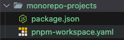

### 1.4 创建 工作空间目录

```bash
mkdir -p projects && mkdir -p components && mkdir -p utils
```

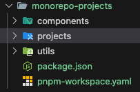

> `projects` 目录用于存放项目子应用
>
> `components` 目录用于存放组件库
>
> `utils` 目录用于存放公共函数库

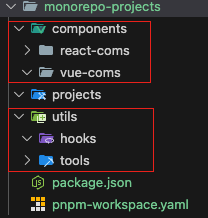

实战中，我们将创建共享包 `utils`或者`hooks`，然后在 Vue 3 子应用中使用这个包。或者创建多种技术栈的组件库，然后在项目子应用中使用这些组件。

### 1.5 配置 `pnpm-workspace.yaml`

配置 `pnpm-workspace.yaml` 文件

```yaml
packages:
  - "components/*"  # 组件库（Vue、React、Angular）等不同技术栈的组件
  - "utils/*"       # 公共函数库(utils、hooks)
  - "projects/*"    # 各个独立应用（Vue、React、Node）
```

> `"components/*"` 表示 `components` 目录下的所有包 放到工作空间中
>
> `"utils/*"` 表示 `utils` 目录下的所有包 放到工作空间中
>
> `"projects/*"` 表示 `projects` 目录下的所有包 放到工作空间中

下面的示例将完成 `utils/tools` & `components/vue-coms` & `projects/vue-app` 的创建和配置。

## 2. 创建公共函数库 utils

### 2.1 创建 tools 包

在 `monorepo-projects/utils` 目录打开终端 或者直接创建文件夹

```bash
mkdir -p tools && cd tools
pnpm init 
```

### 2.2 安装 TypeScript

> 将 TypeScript 作为开发依赖安装到 工作空间中 这样整个工作空间都可以使用 TypeScript

```bash
pnpm add typescript -D --workspace-root
or
pnpm add typescript -D -w
```

安装后，可以在 `monorepo-projects/node_modules` 目录下看到 `typescript` 包

`monorepo-projects/package.json` 记录在工作空间里的包

### 2.3 创建 utils 代码

路径：`monorepo-projects/utils/tools/src`

```ts
// sum.ts
export const sum = (a: number, b: number): number => a + b;
```

```ts
// sub.ts
export const add = (a: number, b: number): number => a + b;
```

创建入口函数

```ts
// index.ts
export * from "./sum";
export * from "./sub";
```

### 2.4 安装 vitest 测试工具

```bash
pnpm add vitest -D -w
```


将 `vitest` 作为开发依赖安装到工作空间中 以便在需要测试的包中使用

### 2.5 编写测试用例

公用函数或者组件库都需要编写测试用例，这里以 `` 为例

路径：`monorepo-projects/utils/tools/tests`

```ts
// sum.test.ts
import { sum } from "../src/sum";

test("计算3 + 3 的结果", () => {
  expect(sum(3, 3)).toBe(6);
});

```

```ts
// sub.test.ts
import { sub } from "../src/sub";

test("计算10 - 2 的结果", () => {
  expect(sub(10, 2)).toBe(8);
});

```

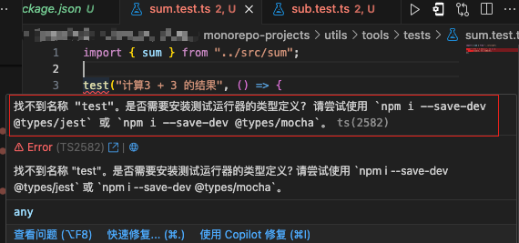

> 如果发现test()、expect()等方法无法识别，可以在 `utils/tools` 根目录下创建 `global.d.ts` 文件
>
> 这是因为 TypeScript 默认不识别 vitest 的全局变量，需要手动将 `vitest/global` 中的类型 引入到全局声明文件中

```ts
// tools/global.d.ts
/// <reference types="vitest/globals"/>
```

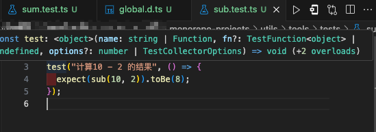

> 这样就可以在测试用例中使用 `test()`、`expect()` 等方法了

### 2.6 添加测试命令脚本

```json
{
 //...
  "scripts": {
    "test": "vitest",
  },
  //...
}
```

```bash
pnpm run test
```

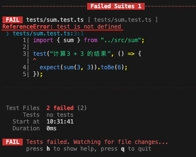

> 前面添加了的 `global.d.ts` 文件 只是提供了ts的声明，但是并没有真正的引入 `vitest`
>
> 所以还需要在 根目录下创建 `vitest.config.ts` 文件，用于配置 `vitest` 的测试环境
>
> 这里不用再安装 `vitest`，因为已经在工作空间中安装了

```ts
//tools/vitest.config.ts
import { defineConfig } from "vitest/config";

export default defineConfig({
  test: {
    // 表示 vitest 会在 src 目录下查找所有的测试文件
    // 自动将常见的测试工具导入到全局环境中
    // 例如 test、expect、describe 等
    globals: true,
    // 配置 vitest 的运行环境
    environment: "node",
  },
});
```

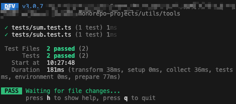

可以看到测试通过了

### 2.7 打包 tools 包

打包做两件事

- 调整 ts 配置选项
    生成 `tsconfig.build.json` 文件

    ```bash
    npx tsc --init
    ```

    修改 `tsconfig.build.json` 文件

    ```json
    {
        "compilerOptions": {
            "target": "ES2015",
            "module": "ES2015",
            "declaration": true,
            "declarationDir": "./dist/types",
            "esModuleInterop": true, 
            "forceConsistentCasingInFileNames": true
        },
        "include": [
            "src/**/*"
        ]
    }
    ```

    > `declaration` 表示生成声明文件，这样别人引用时可以看到函数的类型
    >
    > `declarationDir` 表示声明文件的输出目录
    >
    > `esModuleInterop` 表示允许在导入时使用 `import` 语法
    >
    > `forceConsistentCasingInFileNames` 表示强制文件名大小写一致

- 使用 `roolup` 打包

  - 安装 `rollup` 相关依赖 到工作空间（`monorepo-projects/package.json`）中

    ```bash
    pnpm add rollup rollup-plugin-typescript2 @rollup/plugin-commonjs @rollip/plugin-node-resolve @rollup/plugin-json @babel/preset-env @rollup/plugin-babel -D -w
    ```

    > `rollup-plugin-typescript2` 用于编译 TypeScript
    >
    > `@rollup/plugin-commonjs` 用于将 CommonJS 模块转换为 ES6 模块
    >
    > `@rollup/plugin-node-resolve` 用于解析第三方模块
    >
    > `@rollup/plugin-json` 用于解析 JSON 文件
    >
    > `@rollup/plugin-babel` 用于将 ES6+ 语法转换为 ES5 语法
    >
    > `@babel/preset-env` 用于根据配置的目标浏览器转换 ES6+ 语法

  - 创建 `rollup.config.js` 配置文件

    ```js
    // tools/rollup.config.js
    // 导入各种插件
    import typescript from "rollup-plugin-typescript2";
    import commonjs from "@rollup/plugin-commonjs";
    import resolve from "@rollup/plugin-node-resolve";
    import json from "@rollup/plugin-json";
    import babel from "@rollup/plugin-babel";

    const extensions = [".js", ".ts"];

    // 导出一个数组，数组里面每一个对象对应一种格式的配置
    export default [
      // CommonJS
      {
          input: "src/index.ts",
          output: {
          file: "dist/index.cjs",
          format: "cjs",
          },
          plugins: [
          typescript({
              useTsconfigDeclarationDir: true,
          }),
          resolve({ extensions }),
          commonjs(),
          json(),
          ],
      },
      // ESM
      {
          input: "src/index.ts",
          output: {
          file: "dist/index.js",
          format: "es",
          },
          plugins: [
          typescript({
              useTsconfigDeclarationDir: true,
          }),
          resolve({ extensions }),
          commonjs(),
          json(),
          ],
      },
      // Browser-compatible
      {
          input: "src/index.ts",
          output: {
          file: "dist/index.browser.js",
          format: "iife",
          name: "jsTools",
          },
          plugins: [
          typescript({
              useTsconfigDeclarationDir: true,
          }),
          resolve({ extensions }),
          commonjs(),
          json(),
          babel({
              exclude: "node_modules/**",
              extensions,
              babelHelpers: "bundled",
              presets: [
              [
                  "@babel/preset-env",
                  {
                  targets: "> 0.25%, not dead",
                  },
              ],
              ],
          }),
          ],
      },
    ];
    ```

    > `rollup.config.js` 配置文件中，导出一个数组，数组里面每一个对象对应一种格式的配置
    >
    > `input` 表示入口文件
    >
    > `output` 表示输出文件
    >
    > `plugins` 表示使用的插件

  - 添加打包命令脚本

    ```json
    {
    //...
    "scripts": {
        "build": "rollup -c",
    },
    //...
    }
    ```

    > `rollup -c` 表示使用 `rollup.config.js` 配置文件进行打包

    ```bash
    pnpm run build
    ```

    

    > 打包后会在 `dist` 目录下生成打包后的文件
    >
    > 可以看到生成了 `index.cjs`、`i ndex.js`、`index.browser.js` 以及 `types` 文件夹**声明文件**

### 2.8 配置入口文件

在 `package.json` 中指定入口文件
> 这样别人引用时可以直接引用到 `dist` 目录下的文件

```json
{
  //...
  "type": "module",
  "main": "index.js",
  "module": "index.js",
  "exports": {
    ".": {
      "import": "./dist/index.js",
      "require": "./dist/index.cjs"
    }
  },
  //...
} 
```

> `type: module` 表示使用 ES Module 语法
>
> `main` 表示 CommonJS 模块的入口文件
>
> `module` 表示 ES Module 模块的入口文件
>
> `exports` 表示导出的入口文件

## 3. 创建 Vue 3 子应用

测试 `utils/tools` 包是否可以在 Vue 3 子应用中使用

在 `monorepo-projects/projects` 目录打开终端 或者直接创建文件夹

```bash
mkdir -p vue-app && cd vue-app
pnpm create vite . --template vue-ts
pnpm install
```

### 3.1 安装工作空间中的 `tools` 包

```bash
pnpm add tools --workspace --filter vue-app
```

> `tools` 表示安装 `utils/tools` 包
>
> `--workspace` 表示安装工作空间中的包
>
> `--filter vue-app` 表示安装到 `vue-app` 包中
>
> 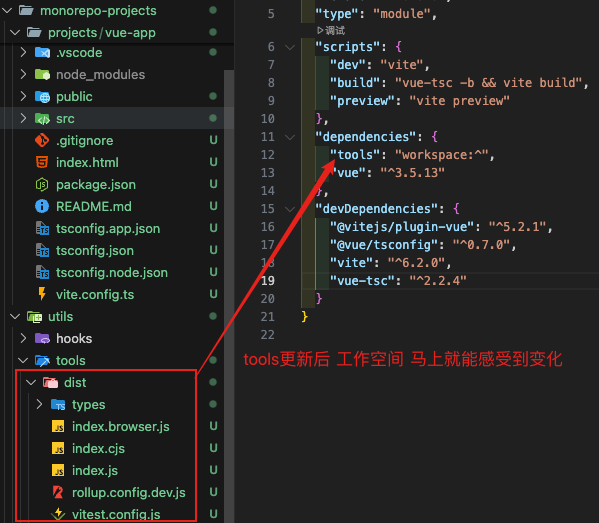

### 3.2 在 Vue 组件中使用 utils

路径：`apps/vue-app/src/App.vue`

```vue
<script setup lang="ts">
import { sum } from "tools";

const result = sum(3, 5);
</script>

<template>
  <h1>Vue Monorepo</h1>
  <p>3 + 5 = {{ result }}</p>
</template>
```

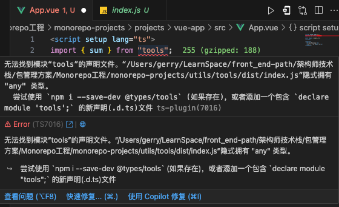

> 这里使用了 `import { sum } from "tools";` 引入了 `utils/tools` 包
>
> 但是缺乏ts的配置文件
>
> 在utils/tools 的 `package.json` 中添加 `types` 字段

```json
{
  //...
  "types": "./dist/types/index.d.ts",
  //...
}
```

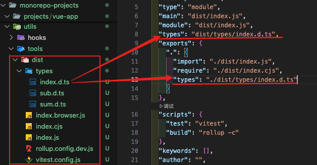

配置完成后，可以看到 Vue 3 子应用中使用了 `utils/tools` 包

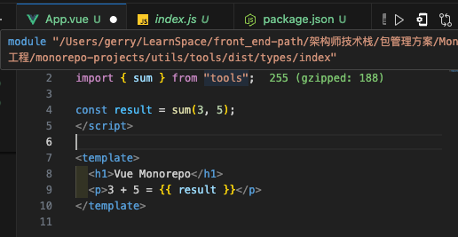

### 3.3 启动 Vue 3 子应用

```bash
pnpm run dev
```


## 4. 搭建内部组件库

这里我新开了一个文档，专门讲解如何搭建一个内部组件库，可以查看 [搭建内部组件库](./搭建公司内部组件库.md)

## 5. 运行 Monorepo

### 5.1 安装&启动所有项目

```bash
pnpm install
pnpm -r run dev
```

### 5.2 访问应用

| 项目 | 地址 |
| --- | --- |
| Vue 3 子应用 | <http://localhost:3000> |
