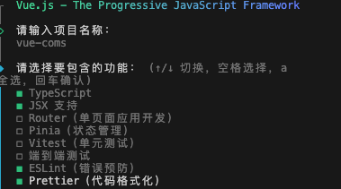

# 从0到1搭建 Monorepo 工程

使用 pnpm 搭建 Monorepo 项目

## 1. 初始化 Monorepo 项目

### 1.1 创建项目目录

```bash
mkdir monorepo-project && cd monorepo-project
```

### 1.2 初始化 pnpm 工作区

```bash
pnpm init 
```

### 1.3 配置 pnpm-workspace.yaml

在 `monorepo-project/pnpm-workspace.yaml` 创建配置文件

```yaml
packages:
  - "packages/*"   # 业务逻辑的公共包（utils、组件库等）
  - "apps/*"       # 各个独立应用（Vue、React、Node）
```

## 2. 创建共享包（Utils 库）

### 2.1 创建 utils 包

```bash
mkdir -p packages/utils && cd packages/utils
pnpm init 
```

### 2.2 安装 TypeScript

```bash
pnpm add typescript -D
```

### 2.3 配置 tsconfig.json

在 `packages/utils/tsconfig.json` 创建配置文件

```json
{
  "compilerOptions": {
    "target": "ESNext",
    "module": "ESNext",
    "declaration": true,
    "outDir": "dist",
    "strict": true
  },
  "include": ["src"]
}
```

### 2.4 创建 utils 代码

```bash
export function add(a: number, b: number): number {
  return a + b;
}
```

### 2.5 修改 package.json

```json
{
  "name": "@monorepo/utils",
  "version": "1.0.0",
  "main": "dist/index.js",
  "types": "dist/index.d.ts",
  "scripts": {
    "build": "tsc"
  },
  "dependencies": {},
  "devDependencies": {
    "typescript": "^4.5.5"
  }
}
```

### 2.6 构建 utils 包

在 `packages/utils/package.json` 中添加构建脚本

```json
{
//...
  "scripts": {
    "build": "tsc"
  }
  //...
}
```

执行构建命令：

```bash
pnpm run build
```

## 3. 创建 Vue 3 子应用

```bash
mkdir -p apps/vue-app && cd apps/vue-app
pnpm create vite . --template vue-ts
pnpm install
```

### 3.1 修改 package.json

添加 `"@monorepo/utils": "workspace:*"` 依赖

注意：

- `workspace:*` 表示依赖于 Monorepo 项目中的 `@monorepo/utils` 包
- `"@monorepo/utils"` 也就是 `packages/utils` 中 `package.json` 中的 `name` 字段

```json
{
  //...
    "dependencies": {
        //...
        "@monorepo/utils": "workspace:*"
    }
    //...
}
```

### 3.2 在 Vue 组件中使用 utils

路径：`apps/vue-app/src/App.vue`

```vue
<script setup lang="ts">
import { add } from "@monorepo/utils";

const result = add(3, 5);
</script>

<template>
  <h1>Vue Monorepo</h1>
  <p>3 + 5 = {{ result }}</p>
</template>
```

### 3.3 启动 Vue 3 子应用

```bash
pnpm run dev
```



## 4. 创建 项目 子应用 这里就不一一演示了，和 Vue 3 子应用类似

## 5. 运行 Monorepo

### 5.1 安装&启动所有项目

```bash
pnpm install
pnpm -r run dev
```

### 5.2 访问应用

| 项目 | 地址 |
| --- | --- |
| Vue 3 子应用 | <http://localhost:3000> |
