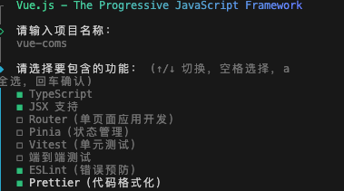
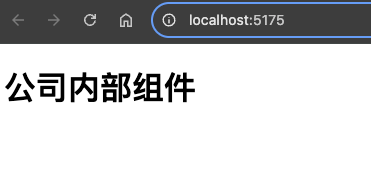
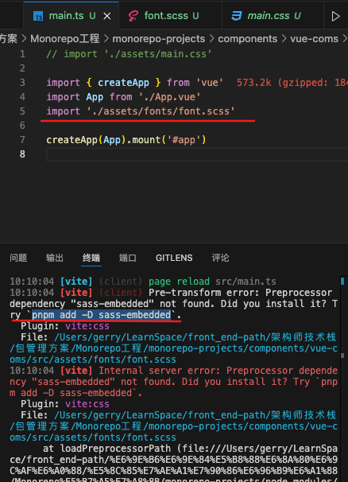
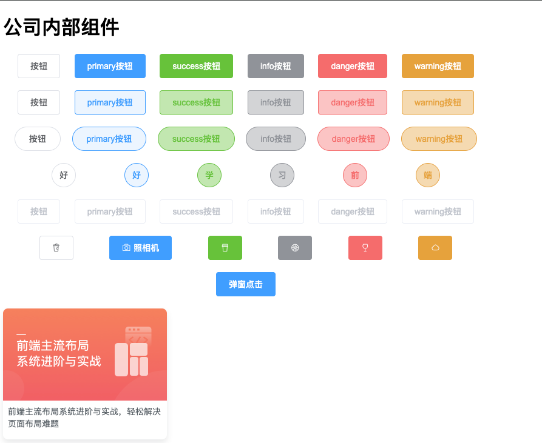
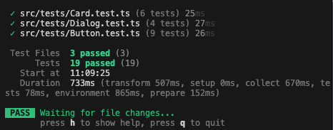

# 搭建公司内部组件库

## 1. 创建组件库

```bash
cd components
pnpm create vue@latest
```



这里的 `vitest` 是我们在根目录安装的测试工具 所以子应用也可以使用,这里就不需要安装了

## 2. 添加项目所需资源

### 2.1 先移除默认样式

```vue
// App.vue
<template>
  <h1>公司内部组件</h1>
</template>

<script setup lang="ts"></script>

<style scoped></style>
```

```ts
// main.ts
// import './assets/main.css'
```



### 2.2 添加所需资源

添加资源文件

`assets/fonts/element-icons.ttf`

`assets/fonts/element-icons.woff`

[资源链接](https://github.com/ElementUI/theme-preview/blob/master/fonts/element-icons.ttf)

[styles/normalize.scss](https://github.com/kristerkari/normalize.scss/blob/master/_normalize.scss)

> `fonts/element-icons.ttf` 是 ElementUI 的图标字体文件
>
> `fonts/element-icons.woff` 是 ElementUI 的图标字体文件
>
> `normalize.scss` 是一个 CSS reset 文件
>



导入字体文件会提示未安装sass-embeedded

将 `sass-embedded` 安装到工作空间中，以便所有子应用都可以使用

```bash
pnpm add -D sass-embedded -w
```

## 3. 添加组件

### Button 组件

路径：`components/vue-coms/src/components/Button.vue`

```vue
<template>
  <button
    class="gy-button"
    :class="[
      `gy-button-${type}`,
      {
        'is-plain': plain,
        'is-round': round,
        'is-circle': circle,
        'is-disabled': disabled,
      },
    ]"
    :disabled="disabled"
    @click="handleClick"
  >
    <i v-if="icon" :class="`gy-icon-${icon}`"></i>
    <span v-if="$slots.default">
      <slot></slot>
    </span>
  </button>
</template>

<script lang="ts" setup>
// 接收一组props属性
defineProps({
  type: {
    type: String,
    default: 'default',
  },
  plain: {
    type: Boolean,
    default: false,
  },
  round: {
    type: Boolean,
    default: false,
  },
  circle: {
    type: Boolean,
    default: false,
  },
  disabled: {
    type: Boolean,
    default: false,
  },
  icon: {
    type: String,
    default: '',
  },
})

const emit = defineEmits(['click'])

function handleClick(e: Event) {
  emit('click', e)
}
</script>
<script lang="ts">
export default {
  name: 'GyButton',
}
</script>

<style lang="scss" scoped>
.gy-button {
  display: inline-block;
  line-height: 1;
  white-space: nowrap;
  cursor: pointer;
  background: #ffffff;
  border: 1px solid #dcdfe6;
  color: #606266;
  appearance: none;
  -webkit-appearance: none;
  text-align: center;
  box-sizing: border-box;
  outline: none;
  margin: 0;
  transition: 0.1s;
  font-weight: 500;
  user-select: none;
  -moz-user-select: none;
  -webkit-user-select: none;
  -moz-user-select: none;
  -ms-user-select: none;
  padding: 12px 20px;
  font-size: 14px;
  border-radius: 4px;

  &:hover,
  &:hover {
    color: #409eff;
    border-color: #c6e2ff;
    background-color: #ecf5ff;
  }
}

.gy-button-primary {
  color: #fff;
  background-color: #409eff;
  border-color: #409eff;

  &:hover,
  &:focus {
    background: #66b1ff;
    background-color: #66b1ff;
    color: #fff;
  }
}

.gy-button-success {
  color: #fff;
  background-color: #67c23a;
  border-color: #67c23a;

  &:hover,
  &:focus {
    background: #85ce61;
    background-color: #85ce61;
    color: #fff;
  }
}

.gy-button-info {
  color: #fff;
  background-color: #909399;
  border-color: #909399;

  &:hover,
  &:focus {
    background: #a6a9ad;
    background-color: #a6a9ad;
    color: #fff;
  }
}

.gy-button-warning {
  color: #fff;
  background-color: #e6a23c;
  border-color: #e6a23c;

  &:hover,
  &:focus {
    background: #ebb563;
    background-color: #ebb563;
    color: #fff;
  }
}

.gy-button-danger {
  color: #fff;
  background-color: #f56c6c;
  border-color: #f56c6c;

  &:hover,
  &:focus {
    background: #f78989;
    background-color: #f78989;
    color: #fff;
  }
}

.gy-button.is-plain {
  &:hover,
  &:focus {
    background: #fff;
    border-color: #489eff;
    color: #409eff;
  }
}

.gy-button-primary.is-plain {
  color: #409eff;
  background: #ecf5ff;

  &:hover,
  &:focus {
    background: #409eff;
    border-color: #409eff;
    color: #fff;
  }
}

.gy-button-success.is-plain {
  color: #67c23a;
  background: #c2e7b0;

  &:hover,
  &:focus {
    background: #67c23a;
    border-color: #67c23a;
    color: #fff;
  }
}

.gy-button-info.is-plain {
  color: #909399;
  background: #d3d4d6;

  &:hover,
  &:focus {
    background: #909399;
    border-color: #909399;
    color: #fff;
  }
}

.gy-button-warning.is-plain {
  color: #e6a23c;
  background: #f5dab1;

  &:hover,
  &:focus {
    background: #e6a23c;
    border-color: #e6a23c;
    color: #fff;
  }
}

.gy-button-danger.is-plain {
  color: #f56c6c;
  background: #fbc4c4;

  &:hover,
  &:focus {
    background: #f56c6c;
    border-color: #f56c6c;
    color: #fff;
  }
}

.gy-button.is-round {
  border-radius: 20px;
  padding: 12px 23px;
}

.gy-button.is-circle {
  border-radius: 50%;
  padding: 12px;
}

.gy-button.is-disabled,
.gy-button.is-disabled:focus,
.gy-button.is-disabled:hover {
  color: #c0c4cc;
  cursor: not-allowed;
  background-image: none;
  background-color: #fff;
  border-color: #ebeef5;
}

.gy-button.is-disabled,
.gy-button.is-disabled:focus,
.gy-button.is-disabled:hover {
  color: #c0c4cc;
  cursor: not-allowed;
  background-image: none;
  background-color: #fff;
  border-color: #ebeef5;
}

.gy-button--primary.is-disabled,
.gy-button--primary.is-disabled:active,
.gy-button--primary.is-disabled:focus,
.gy-button--primary.is-disabled:hover {
  color: #fff;
  background-color: #a0cfff;
  border-color: #a0cfff;
}

.gy-button--success.is-disabled,
.gy-button--success.is-disabled:active,
.gy-button--success.is-disabled:focus,
.gy-button--success.is-disabled:hover {
  color: #fff;
  background-color: #b3e19d;
  border-color: #b3e19d;
}

.gy-button--info.is-disabled,
.gy-button--info.is-disabled:active,
.gy-button--info.is-disabled:focus,
.gy-button--info.is-disabled:hover {
  color: #fff;
  background-color: #c8c9cc;
  border-color: #c8c9cc;
}

.gy-button--warning.is-disabled,
.gy-button--warning.is-disabled:active,
.gy-button--warning.is-disabled:focus,
.gy-button--warning.is-disabled:hover {
  color: #fff;
  background-color: #f3d19e;
  border-color: #f3d19e;
}

.gy-button--danger.is-disabled,
.gy-button--danger.is-disabled:active,
.gy-button--danger.is-disabled:focus,
.gy-button--danger.is-disabled:hover {
  color: #fff;
  background-color: #fab6b6;
  border-color: #fab6b6;
}

.gy-button [class*='gy-icon-'] + span {
  margin-left: 5px;
}
</style>
```

### Card 组件

路径：`components/vue-coms/src/components/Card.vue`

```vue
<template>
  <div class="gy-card" :style="width ? { width: width + 'px' } : {}">
    <!-- 里面分为三个部分 -->
    <!-- 1.图片 -->
    <div class="gy-card-img" :style="imgHeight ? { height: imgHeight + 'px' } : {}">
      
    </div>
    <!-- 2.描述 -->
    <div v-if="summary" class="gy-card-summary">{{ summary }}</div>
    <div v-else class="gy-card-summary">
      <slot></slot>
    </div>
    <!-- 3.底部 -->
    <div class="gy-card-footer">
      <slot name="footer"></slot>
    </div>
  </div>
</template>

<script setup lang="ts">
defineProps({
  width: {
    type: Number,
    default: 0,
  },
  imgSrc: {
    type: String,
    default: '',
    required: true,
  },
  imgHeight: {
    type: Number,
    default: 0,
  },
  summary: {
    type: String,
    default: '',
  },
})
</script>
<script lang="ts">
export default {
  name: 'GyCard',
}
</script>

<style lang="scss" scoped>
.gy-card {
  width: 270px;
  border-radius: 8px;
  background: #fff;
  overflow: hidden;
  box-shadow: 0 6px 10px 0 rgba(95, 101, 105, 0.15);
  padding-bottom: 8px;

  &-img {
    height: 152px;
    margin-bottom: 8px;

    img {
      width: 100%;
      height: 100%;
    }
  }

  &-summary {
    padding: 0 8px;
    text-align: left;
    font-size: 14px;
    color: #545c63;
    line-height: 20px;
    height: 40px;
    margin-bottom: 8px;
  }
}
</style>
```

### Dialog 组件

路径：`components/vue-coms/src/components/Dialog.vue`

```vue
<template>
  <transition name="dialog-fade">
    <div class="gy-dialog_wrapper" v-show="visible">
      <div class="gy-dialog" :style="{ width: width, marginTop: top }">
        <!-- 头部 -->
        <div class="gy-dialog_header">
          <slot name="title">
            <!-- 将span放到slot内，这样不仅可以定义title文本，还可以定义样式等 -->
            <span class="gy-dialog_title">
              {{ title }}
            </span>
          </slot>
          <!-- 关闭按钮 -->
          <button class="gy-dialog_headerbtn" @click="handleClose">
            <i class="gy-icon-close"></i>
          </button>
        </div>
        <!-- 中间区域：默认插槽 -->
        <div class="gy-dialog_body">
          <slot></slot>
        </div>
        <!-- 底部 -->
        <div class="gy-dialog_footer">
          <!-- 如果footer不传递内容，则不显示footer -->
          <slot name="footer" v-if="$slots.footer"></slot>
        </div>
      </div>
    </div>
  </transition>
</template>

<script setup lang="ts">
defineProps({
  title: {
    type: String,
    default: '提示',
  },
  width: {
    type: String,
    default: '50%',
  },
  top: {
    type: String,
    default: '15vh',
  },
  visible: {
    type: Boolean,
    default: false,
  },
})
const emits = defineEmits(['close'])
function handleClose() {
  emits('close')
}
</script>
<script lang="ts">
export default {
  name: 'GyDialog',
}
</script>

<style lang="scss" scoped>
.gy-dialog_wrapper {
  position: fixed;
  top: 0;
  right: 0;
  bottom: 0;
  left: 0;
  overflow: auto;
  margin: 0;
  z-index: 2001;
  background-color: rgba(0, 0, 0, 0.5);

  .gy-dialog {
    position: relative;
    margin: 15vh auto 50px;
    background: #fff;
    border-radius: 2px;
    box-shadow: 0 1px 3px rgba(0, 0, 0, 0.3);
    box-sizing: border-box;
    width: 30%;

    &_header {
      padding: 20px 20px 10px;

      .gy-dialog_title {
        line-height: 24px;
        font-size: 18px;
        color: #303133;
      }

      .gy-dialog_headerbtn {
        position: absolute;
        top: 20px;
        right: 20px;
        padding: 0;
        background: transparent;
        border: none;
        outline: none;
        cursor: pointer;
        font-size: 16px;

        .gy-icon-close {
          color: 909399;
        }
      }
    }

    &_body {
      padding: 30px 20px;
      color: #606266;
      font-size: 14px;
      word-break: break-all;
    }

    &_footer {
      padding: 10px 20px 20px;
      text-align: right;
      box-sizing: border-box;

      :deep(.gy-button:first-child) {
        margin-right: 20px;
      }
    }
  }
}

.dialog-fade-enter-active {
  animation: fade 0.3s;
}

.dialog-fade-leave-active {
  animation: fade 0.3s reverse;
}

@keyframes fade {
  0% {
    opacity: 0;
    transform: translateY(-30px);
  }

  100% {
    opacity: 1;
    transform: translateY(0);
  }
}
</style>
```

暂时添加这三个组件 用于演示

## 4. 修改 main.ts

全局注册组件(这样才能识别组件样式)

```ts
import { createApp } from 'vue'
import App from './App.vue'
import './assets/fonts/font.scss'

// 引入自定义组件
import Button from './components/Button.vue'
import Card from './components/Card.vue'
import Dialog from './components/Dialog.vue'

const app = createApp(App)

// 全局注册组件
app.component(Button.name as string, Button)
app.component(Card.name as string, Card)
app.component(Dialog.name as string, Dialog)

app.mount('#app')
```

## 5. 修改 App.vue

```vue
<template>
  <h1>公司内部组件</h1>
  <!-- 按钮组件测试 -->
  <div class="row">
    <gy-button>按钮</gy-button>
    <gy-button type="primary">primary按钮</gy-button>
    <gy-button type="success">success按钮</gy-button>
    <gy-button type="info">info按钮</gy-button>
    <gy-button type="danger">danger按钮</gy-button>
    <gy-button type="warning">warning按钮</gy-button>
  </div>
  <div class="row">
    <gy-button plain>按钮</gy-button>
    <gy-button plain type="primary">primary按钮</gy-button>
    <gy-button plain type="success">success按钮</gy-button>
    <gy-button plain type="info">info按钮</gy-button>
    <gy-button plain type="danger">danger按钮</gy-button>
    <gy-button plain type="warning">warning按钮</gy-button>
  </div>
  <div class="row">
    <gy-button plain round>按钮</gy-button>
    <gy-button plain round type="primary">primary按钮</gy-button>
    <gy-button plain round type="success">success按钮</gy-button>
    <gy-button plain round type="info">info按钮</gy-button>
    <gy-button plain round type="danger">danger按钮</gy-button>
    <gy-button plain round type="warning">warning按钮</gy-button>
  </div>
  <div class="row">
    <gy-button plain round circle>好</gy-button>
    <gy-button plain round circle type="primary">好</gy-button>
    <gy-button plain round circle type="success">学</gy-button>
    <gy-button plain round circle type="info">习</gy-button>
    <gy-button plain round circle type="danger">前</gy-button>
    <gy-button plain round circle type="warning">端</gy-button>
  </div>
  <div class="row">
    <gy-button disabled>按钮</gy-button>
    <gy-button disabled type="primary">primary按钮</gy-button>
    <gy-button disabled type="success">success按钮</gy-button>
    <gy-button disabled type="info">info按钮</gy-button>
    <gy-button disabled type="danger">danger按钮</gy-button>
    <gy-button disabled type="warning">warning按钮</gy-button>
  </div>
  <div class="row">
    <gy-button icon="milk-tea"></gy-button>
    <gy-button type="primary" icon="camera">照相机</gy-button>
    <gy-button type="success" icon="coffee"></gy-button>
    <gy-button type="info" icon="orange"></gy-button>
    <gy-button type="danger" icon="goblet"></gy-button>
    <gy-button type="warning" icon="cloudy"></gy-button>
  </div>
  <div class="row">
    <gy-button type="primary" @click="clickHandle">点击</gy-button>
  </div>

  <!-- 卡片测试1 -->
  <gy-card imgSrc="/images/web.png" summary="前端主流布局系统进阶与实战，轻松解决页面布局难题" />
  <br />
  <!-- 卡片测试2 -->
  <gy-card imgSrc="/images/go.png" summary="Google资深工程师深度讲解Go语言 由浅入深掌握Go语言">
    <template v-slot:footer>
      <div class="footer">
        <div class="level">中级 · 5225人报名</div>
        <div class="price">￥399.00</div>
      </div>
    </template>
  </gy-card>
  <br />
  <!-- 卡片测试3 -->
  <gy-card imgSrc="/images/java.png" :width="370" :imgHeight="90">
    路线吃透面试学问，伴随身为Java工程师的你一路成长，高效充分准备面试拿offer。
    <template v-slot:footer>
      <div class="footer-java">
        <div class="level">3步骤 · 3门课</div>
        <div class="level">10982收藏</div>
      </div>
    </template>
  </gy-card>

  <!-- 弹出框组件测试 -->
  <gy-dialog title="温馨提示" width="30vw" v-model:visible="visible" @close="closeDialog">
    这是一个 Dialog 弹出框
    <template v-slot:footer>
      <gy-button @click="closeDialog">取消</gy-button>
      <gy-button type="primary" @click="closeDialog">确定</gy-button>
    </template>
  </gy-dialog>
</template>

<script setup lang="ts">
import { ref } from 'vue'
const visible = ref(false)
function closeDialog() {
  visible.value = false
}

function clickHandle() {
  // alert('点击了按钮')
  visible.value = true
}
</script>

<style scoped>
.row {
  margin-bottom: 20px;
  width: 800px;
  display: flex;
  justify-content: space-evenly;
}

.footer {
  padding: 0 8px;
  font-size: 12px;
  text-align: left;
}

.level {
  color: #9199a1;
  margin-bottom: 8px;
}

.price {
  color: #f01414;
}

.footer-java {
  display: flex;
  justify-content: space-between;
  font-size: 12px;
  padding: 0 8px;
}
</style>
```

## 6. 运行组件库

路径：`components/vue-coms` 下执行

```bash
pnpm run dev
```



现在看到的界面就等同于组件库的文档页面

## 7. 组件测试用例

### 7.1 安装测试工具

安装模拟浏览器环境 `jsdom` 和 `@vue/test-utils`

```bash
pnpm add @vue/test-utils jsdom -D -w
```

> `@vue/test-utils` 是 Vue 官方提供的测试工具，例如 `mount` 和 `shallowMount`
>
> - `mount` 完整的渲染组件及其子组件
> - `shallowMount` 只渲染组件，不渲染子组件
>
> `jsdom` 是一个模拟浏览器环境的工具，测试涉及到 DOM 操作时需要使用，例如 `click` 事件

### 7.2 测试前的配置

我们移除创建项目时自动生成的`tsconfig.app.json`&`tsconfig.node.json`

修改`tsconfig.json`文件

- tsconfig.json

```json
{
  "compilerOptions": {
    "target": "ES2015",
    "module": "ES2015",
    "declaration": true,
    "declarationDir": "./dist/types",
    "moduleResolution": "Node",
    "esModuleInterop": true,
    "strict": true,
    "skipLibCheck": true,
    "paths": {
      "@/*": ["./src/*"]
    },
    "types": ["node", "vitest/globals", "@vue/test-utils"]
  },
  "include": ["src/**/*.ts", "tests/**/*.ts", "src/**/*.vue"],
  "exclude": ["node_modules", "dist"]
}
```

> `types` 字段中添加了 `vitest/globals` 和 `@vue/test-utils`，这样就可以在测试文件中使用 `vitest` 和 `@vue/test-utils` 提供的全局变量和类型
>
> `include` 字段中添加了 `src/**/*.vue`，这样就可以在测试文件中导入 `.vue` 文件
>
> `exclude` 字段中排除了 `dist` 目录，避免编译时将测试文件编译到 `dist` 目录中
>
> `moduleResolution` 字段设置为 `Node`，这样就可以在测试文件中使用 `@` 符号来引入文件
>
> `paths` 字段设置了 `@/*` 的别名，这样就可以在测试文件中使用 `@` 符号来引入文件
>
> `declaration` 字段设置为 `true`，这样就可以生成声明文件，方便别人引用时看到函数的类型
>
> `declarationDir` 字段设置为 `./dist/types`，这样就可以将声明文件输出到指定目录
>
> `esModuleInterop` 字段设置为 `true`，这样就可以在导入时使用 `import` 语法

- vitest.config.ts

```ts
import { mergeConfig, defineConfig } from 'vitest/config'
import viteConfig from './vite.config'

export default mergeConfig(
  viteConfig,
  defineConfig({
    test: {
      globals: true,
      environment: 'jsdom'
    }
  })
)
```

### 7.3 创建测试文件

- `Button.test.ts`

```ts
import { mount } from '@vue/test-utils'
import Button from '@/components/Button.vue'

describe('Button.vue', () => {
    test('渲染默认类型按钮', () => {
        const wrapper = mount(Button)
        expect(wrapper.classes()).toContain('gy-button')
        expect(wrapper.classes()).toContain('gy-button-default')
      })

  test('按钮渲染类型', () => {
    const wrapper = mount(Button, { props: { type: 'primary' } })
    expect(wrapper.classes()).toContain('gy-button')
    expect(wrapper.classes()).toContain('gy-button-primary')
  })

  test('渲染朴素按钮', () => {
    const wrapper = mount(Button, { props: { plain: true } })
    expect(wrapper.classes()).toContain('is-plain')
  })

  test('渲染圆角按钮', () => {
    const wrapper = mount(Button, { props: { round: true } })
    expect(wrapper.classes()).toContain('is-round')
  })

  test('渲染圆形按钮', () => {
    const wrapper = mount(Button, { props: { circle: true } })
    expect(wrapper.classes()).toContain('is-circle')
  })

  test('渲染不可用状态按钮', () => {
    const wrapper = mount(Button, { props: { disabled: true } })
    expect(wrapper.classes()).toContain('is-disabled')
    expect(wrapper.attributes()).toHaveProperty('disabled')
  })

  test('渲染带图标按钮', () => {
    const wrapper = mount(Button, { props: { icon: 'home' } })
    expect(wrapper.find('i').classes()).toContain('gy-icon-home')
  })

  test('插槽内容按钮', () => {
    const wrapper = mount(Button, { slots: { default: 'Click Me' } })
    expect(wrapper.text()).toContain('Click Me')
  })

  test('测试点击事件', async () => {
    const wrapper = mount(Button)
    await wrapper.trigger('click')
    expect(wrapper.emitted()).toHaveProperty('click')
  })
})
```

- `Card.test.ts`

```ts
import { mount } from '@vue/test-utils'
import Card from '@/components/Card.vue'

// 测试套件
describe('Card.vue', () => {
  it('测试卡片宽度', () => {
    const wrapper = mount(Card, {
      props: {
        width: 300,
        imgSrc: 'https://example.com/example-image.jpg',
      },
    })
    expect(wrapper.attributes('style')).toContain('width: 300px;')
  })

  it('测试卡片图片资源', () => {
    const imgSrc = 'https://example.com/example-image.jpg'
    const wrapper = mount(Card, {
      props: {
        imgSrc,
      },
    })
    expect(wrapper.find('.gy-card-img img').attributes('src')).toBe(imgSrc)
  })

  it('测试卡片图片高度', () => {
    const wrapper = mount(Card, {
      props: {
        imgHeight: 200,
        imgSrc: 'https://example.com/example-image.jpg',
      },
    })
    expect(wrapper.find('.gy-card-img').attributes('style')).toContain('height: 200px;')
  })

  it('测试卡片概要', () => {
    const summary = 'This is a summary.'
    const wrapper = mount(Card, {
      props: {
        summary,
        imgSrc: 'https://example.com/example-image.jpg',
      },
    })
    expect(wrapper.find('.gy-card-summary').text()).toBe(summary)
  })

  it('测试插槽', () => {
    const defaultSlotContent = 'This is default slot content.'
    const wrapper = mount(Card, {
      props: {
        imgSrc: 'https://example.com/example-image.jpg',
      },
      slots: {
        default: defaultSlotContent,
      },
    })
    expect(wrapper.find('.gy-card-summary').text()).toBe(defaultSlotContent)
  })

  it('测试footer插槽', () => {
    const footerSlotContent = 'This is footer slot content.'
    const wrapper = mount(Card, {
      props: {
        imgSrc: 'https://example.com/example-image.jpg',
      },
      slots: {
        footer: footerSlotContent,
      },
    })
    expect(wrapper.find('.gy-card-footer').text()).toBe(footerSlotContent)
  })
})
```

- `Dialog.test.ts`

```ts
import { mount } from '@vue/test-utils'
import Dialog from '@/components/Dialog.vue'

describe('测试Dialog组件', () => {
  it('测试标题和slots', () => {
    const titleSlotContent = '自定义标题'
    const footerSlotContent = '自定义底部'
    const wrapper = mount(Dialog, {
      props: { visible: true, title: titleSlotContent },
      slots: {
        footer: footerSlotContent,
      },
    })

    expect(wrapper.find('.gy-dialog_title').text()).toBe(titleSlotContent)
    expect(wrapper.find('.gy-dialog_footer').text()).toBe(footerSlotContent)
  })

  it('测试宽度', () => {
    const width = '60%'
    const wrapper = mount(Dialog, {
      props: {
        width,
      },
    })
    expect(wrapper.find('.gy-dialog').attributes('style')).toContain(`width: ${width}`)
  })

  it('测试顶部边距', () => {
    const top = '20vh'
    const wrapper = mount(Dialog, {
      props: {
        top,
      },
    })
    expect(wrapper.find('.gy-dialog').attributes('style')).toContain(`margin-top: ${top}`)
  })

  it('触发close事件', async () => {
    const wrapper = mount(Dialog, {
      props: { visible: true },
    })

    const closeButton = wrapper.find('.gy-dialog_headerbtn')
    await closeButton.trigger('click')

    expect(wrapper.emitted('close')).toBeTruthy()
  })
})
```

### 7.4 添加测试命令脚本

```json
{
  //...
  "scripts": {
    "test:unit": "vitest",
  },
  //...
}
```

```bash
pnpm run test:unit
```


