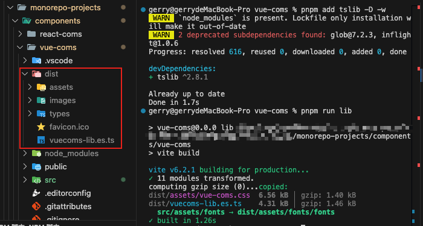
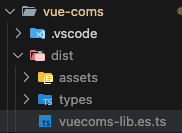

# 组件的打包与引用

前置知识

> 库模式 与 普通应用 的区别

库模式指的是将应用打包成一个依赖库，方便其他应用来使用。因此和普通打包是有一定区别的：

1. 入口文件：
   - 普通应用：html 文件
   - 库模式：不包含 html 文件，入口文件是一个 js 文件(作为一个资源给其他地方引用)
2. 输出格式：
   - 普通应用：一般是浏览器环境
   - 库模式：通常需要支持多种模块系统
3. 外部依赖：
   - 普通应用：需要一起打包进去
   - 库模式：通常需要将外部依赖（vue、react）排除掉

在库模式（lib）中，我们可以定义**入口点**、**库的名称**、**输出文件名**，以及**如何处理外部依赖**。这些配置确保你的库被打包成适用于不同消费场景的格式，如 ES 模块或 UMD 格式。

举一个例子：

```bash
my-lib/
├── lib/
│   ├── main.js        // 库的入口文件
│   ├── Foo.vue        // Vue 组件
│   └── Bar.vue        // 另一个 Vue 组件
├── index.html         // 用于开发测试的 HTML 文件
├── package.json
└── vite.config.js     // Vite 配置文件
```

> Vite 配置文件 (vite.config.js)

```js
// vite.config.js
import { resolve } from 'path'
import { defineConfig } from 'vite'

export default defineConfig({
  build: {
    lib: {
      entry: resolve(__dirname, 'lib/main.js'),
      name: 'MyLib',
      fileName: (format) => `my-lib.${format}.js`
    },
    rollupOptions: {
      external: ['vue'],
      output: {
        globals: {
          vue: 'Vue'
        },
      },
    },
  },
})
```

- entry: 指定库的入口文件。
- name: name 是用来指定你的库在 UMD 和 IIFE 构建格式下的全局变量名称。
  - 当你的库被加载时，如果是在一个没有模块系统的环境（例如直接在浏览器中通过 \<script> 标签引入），这个名称将成为全局变量，通过这个名称可以访问到你的库。
  - 如果你设置 name: 'MyLib'，在浏览器环境中加载时，可以通过 window.MyLib 访问到你的库。

- fileName: 输出文件的命名规则。
- external: 告诉 rollup 不要将 Vue 打包进库，因为我们假设用户环境已有 Vue。
- globals: globals 用于指定外部依赖在 UMD 和 IIFE 构建格式下的全局变量名称。
  - 当你的库依赖某些外部库（如 Vue），你需要告诉构建工具这些库在目标环境中的全局变量名称，以确保在没有模块系统的环境中正确引用这些依赖。
  - 如果你的库依赖 vue，并且 globals 中配置了 vue: 'Vue'，在目标环境中，你的库会假定 Vue 是一个已经存在的全局变量。

> 构建输出

执行 vite build 后，输出目录可能如下所示：

```bash
my-lib/
├── dist/
│   ├── my-lib.es.js        // ES 模块格式
│   ├── my-lib.umd.js       // UMD 格式
│   └── assets/             // 包含所有静态资源，如编译后的 CSS
└── ...
```

> **package.json 配置**

```json
{
  "name": "my-lib",
  "type": "module",
  "files": ["dist"],
  "main": "./dist/my-lib.umd.js",
  "module": "./dist/my-lib.es.js",
  "exports": {
    ".": {
      "import": "./dist/my-lib.es.js",
      "require": "./dist/my-lib.umd.js"
    }
  }
}
```

这里的配置确保了无论是使用 require 还是 import，使用者都能正确地加载到适当格式的文件。

> **将搭建的 Monorepo 工程打包成库**

结合[搭建Monorepo工程](./搭建Monorepo工程.md) 和[搭建公司内部组件库](./搭建公司内部组件库.md)

将 vue组件库 打包成库，方便其他项目引用。

## 1. 配置vite.config.js

找到 monorepo工程 的组件库项目，例如：
`monorepo-projects/components/vuecoms目录下的vite.config.ts`文件，修改如下：

```ts
// vite.config.ts
import { fileURLToPath, URL } from 'node:url'

import { defineConfig } from 'vite'
import vue from '@vitejs/plugin-vue'
import vueJsx from '@vitejs/plugin-vue-jsx'
import vueDevTools from 'vite-plugin-vue-devtools'
import path from 'node:path'
import typescript from 'rollup-plugin-typescript2'
import copy from 'rollup-plugin-copy'

// https://vite.dev/config/
export default defineConfig({
  plugins: [vue(), vueJsx(), vueDevTools()],
  resolve: {
    alias: {
      '@': fileURLToPath(new URL('./src', import.meta.url)),
    },
  },
  build: {
    lib: {
      entry: path.resolve(__dirname, 'src/lib.ts'),
      name: 'vuecoms',
      formats: ['es'],
      fileName: (format) => `vuecoms-lib.${format}.ts`,
    },
    rollupOptions: {
      external: ['vue'],
      output: {
        globals: {
          vue: 'Vue',
        },
        exports: 'named',
        assetFileNames: 'assets/[name].[ext]', // 将静态资源打包到这个文件夹
      },
      plugins: [
        typescript({
          tsconfig: path.resolve(__dirname, 'tsconfig.json'),
          useTsconfigDeclarationDir: true, // 使用tsconfig.json中的声明文件目录
          clean: true, // 清理输出目录
          exclude: [path.resolve(__dirname, 'tests')],
        }),
        copy({
          targets: [{ src: 'src/assets/fonts/*', dest: 'dist/assets/fonts' }], // 复制字体文件
          verbose: true, // 显示详细信息
          hook: 'writeBundle', // 在打包结束后执行
        }),
      ],
    },
    emptyOutDir: true, // 清空上一次打包的文件
  },
})
```

如果从之前项目的基础上配置  还需要安装`rollup-plugin-copy`插件。

```bash
pnpm add rollup-plugin-copy -D -w
```

> **注意：** 这里的配置是将 vue 组件库打包成 es 模块格式，如果需要其他格式，可以在 formats 中添加。

讲解下这个配置：

- `lib`：指定构建为库。
    > - `entry`：指定库的入口文件。
    > - `name`：name 是用来指定你的库在 UMD 和 IIFE 构建格式下的全局变量名称。
    > - `formats`：指定输出格式，这里是 es 模块格式。
    > - `fileName`：输出文件的命名规则。例如，输出文件名为 vuecoms-lib.es.ts。
- `rollupOptions`：rollup 的配置项。
    > - `external`：告诉 rollup 不要将 Vue 打包进库，因为我们假设用户环境已有 Vue。
  - `output`：输出配置。
    > - `globals`：指定外部依赖在 UMD 和 IIFE 构建格式下的全局变量名称。
    > - `exports`：`named` 表示使用命名导出。
    > - `assetFileNames`：将静态资源打包到这个文件夹。
  - `plugins`：插件配置。
    - `typescript`：使用 typescript 插件编译 TypeScript。
        > - `tsconfig`：指定 tsconfig.json 文件。
        > - `useTsconfigDeclarationDir`：使用 tsconfig.json 中的声明文件目录。
        > - `clean`：清理输出目录。
        > - `exclude`：排除的文件。例如，排除 tests 目录。
    - `copy`：复制静态资源。
        > - `targets`：复制的目标。
        > - `verbose`：显示详细信息。
        > - `hook`：在打包结束后执行。
- `emptyOutDir`：清空上一次打包的文件。

## 2. 创建入口文件(src/lib.ts)

```ts
// 库的入口文件
// 核心就是到处一个 install 方法
import type { App, Plugin } from 'vue'
// 引入组件
import Button from './components/Button.vue'
import Card from './components/Card.vue'
import Dialog from './components/Dialog.vue'

const components = [Button, Card, Dialog]

// 定义插件的 install 方法
// 回头用户在使用的时候，只需要引入这个插件，然后通过 app.use() 方法安装插件即可
const install = (app: App) => {
  components.forEach((component) => {
    app.component(component.name as string, component)
  })
}

const vuecoms: Plugin = {
  install,
}

// 导出插件
export default vuecoms
export { Button, Card, Dialog }
```

用户在使用的时候，只需要引入这个插件，然后通过 app.use() 方法安装插件即可。
例如：

```ts
import { createApp } from 'vue'
import App from './App.vue'
import vuecoms from 'vuecoms-lib.es.ts'

const app = createApp(App)
app.use(vuecoms)// 相当于在调用vuecoms.install(app)
app.mount('#app')
```

## 3. 打包

- 添加命令到`lib`命令 `package.json`文件中

```json
{
  "scripts": {
    "lib": "vite build"
  }
}
```

- 执行打包命令

```bash
pnpm run lib
```


我们来解决下这些问题：

### 1. 找不到.vue 文件的声明文件

Cannot find module `'./components/Button.vue'` 表示 TypeScript 在编译时找不到 Button.vue 组件的声明。

解决方法：

> 在 `src` 目录下创建 `shims-vue.d.ts` 文件，添加如下内容：

```ts
declare module '*.vue' {
  import { DefineComponent } from 'vue'
  const component: DefineComponent<{}, {}, any>
  export default component
}
```

文件解释：

所有以 `.vue` 结尾的文件都会被 TypeScript 编译器识别为 V ue 组件。这样就可以在 TypeScript 中正确引入 Vue 组件。

### 2. 没有显式声明 app 的类型

Parameter 'app' implicitly has an 'any' type. 表示 TypeScript 需要 显式声明 app 的类型，否则它默认会被视为 any 类型。

解决方法：

> 在 `tsconfig.json` 文件中 `compilerOptions` 下添加 `"noImplicitAny": false`。

```json
{
  "compilerOptions": {
    "noImplicitAny": false
  }
}
```

打包

```bash
pnpm run lib
```

我这里`typescript` 版本是`5.8.2`比较新，打包报错了 需要 `tslib` 库。

### 3. 缺少 tslib 库

如果之前安装的是`typescript`版本是`5.5.4`，那么不需要安装`tslib`库。

我的`typescript`版本是`5.8.2`，需要安装`tslib`库。

```bash
pnpm add tslib -D -w
```

然后再次打包

```bash
pnpm run lib
```

## 4. 打包成功



打包成功后，会在`dist`目录下生成`vuecoms-lib.es.ts`文件。

### 4.1 解决打包后的问题


- 不需要 `public` 目录下的静态资源

解决方法：

在`vue-coms`目录下创建`postbuild.js`文件，添加如下内容：

```js
// postbuild.js
// 将打包后 public 里面的资源删除掉

import fs from 'fs'
import path from 'path'
import { fileURLToPath } from 'node:url'
import { dirname } from 'node:path'

// 获取当前文件所在的目录
const __dirname = dirname(fileURLToPath(import.meta.url))

// 定义要删除的目录和文件
const imagesDir = path.resolve(__dirname, 'dist/images')
const faviconFile = path.resolve(__dirname, 'dist/favicon.ico')

// 删除 dist/images 目录
if (fs.existsSync(imagesDir)) {
  fs.rmSync(imagesDir, { recursive: true, force: true })
  console.log('Deleted directory: ', imagesDir)
} else {
  console.log('No images directory to delete.')
}

// 删除 dist/favicon.ico 文件
if (fs.existsSync(faviconFile)) {
  fs.unlinkSync(faviconFile)
  console.log('Deleted file: ', faviconFile)
} else {
  console.log('No favicon.ico file to delete.')
}
```

在`package.json`文件中添加`postbuild`命令

```json
{
  "scripts": {
    "lib": "vite build && pnpm run postbuild",
    "postbuild": "node postbuild.js"
  }
}
```

再次打包

```bash
pnpm run lib
```



可以看到`dist`目录下的`images`目录和`favicon.ico`文件已经被删除了。

- 将`main.d.ts` 也打包进来了，这是不需要的

解决方法：

1. 在`tsconfig.json`文件中的`exclude`移除`tests`、`src/main.ts`文件。

    ```json
    {
    "exclude": ["node_modules", "dist", "tests", "src/main.ts"]
    }
    ```

2. 在`vite.config.ts`文件中的`rollupOptions/plugins/typescript`中添加`exclude`选项。

    ```ts
    typescript({
    ...
    exclude: ['tests', '**/*.test.ts'],
    }),
    ```

再次打包

```bash
pnpm run lib
```


现在`dist`目录下已经没有`main.d.ts`文件了。以及`tests`目录下的文件也不会被打包进来。

### 4.2 配置入口文件

- `package.json`

```json
{
  "name": "vue-coms",
  "version": "0.0.0",
  "private": true, 
  "type": "module",
  "module": "./dist/vuecoms-lib.es.ts",
  "types": "./dist/types/lib.d.ts",
  "exports": {
    ".": {
      "import": "./dist/vuecoms-lib.es.ts",
      "types": "./dist/types/lib.d.ts"
    },
    "./assets/style.css": "./dist/assets/vue-coms.css",
    "./assets/font.scss": "./dist/assets/fonts/font.scss"
  },
  //...
}
```

解释`exports`字段：
>
> - `import`：指定入口文件。
> - `types`：指定声明文件。
> - `./assets/style.css`：指定样式文件。用户可以通过 `import 'vue-coms/assets/style.css'` 引入样式。
> - `./assets/font.scss`：指定字体文件。 用户可以通过 `import 'vue-coms/assets/font.scss'` 引入字体。

## 5. 在vue项目中引用

我们在之前创建的`projects/vue-app`项目中引入`vue-coms`组件库。

### 5.1 安装`vue-coms`组件库

在`vue-app`项目中安装`vue-coms`组件库

```bash
pnpm add vue-coms --workspace --filter vue-app
```

解释下这个命令：
>
> - `--workspace`：表示在工作空间中安装。
> - `--filter vue-app`：表示只在 vue-app 项目中安装。

### 5.2 使用`vue-coms`组件库

```ts
import { createApp } from "vue";
import "./style.css";
import App from "./App.vue";

// 从工作空间引入组件库 
import vuecoms from "vue-coms";
import "vue-coms/assets/style.css";
import "vue-coms/assets/fonts/font.scss";

const app = createApp(App);

// 背后就是执行 vuecoms 的入口文件 lib.ts 中的 install 方法
app.use(vuecoms);
app.mount("#app");

```

```vue
// App.vue
<script setup lang="ts">
import { ref } from "vue";
import { sum } from "tools";

const result = sum(3, 5);
const visible = ref(false);
function closeDialog() {
  visible.value = false;
}

function clickHandle() {
  // alert('点击了按钮')
  visible.value = true;
}
</script>

<template>
  <h1>Vue Monorepo</h1>
  <p>3 + 5 = {{ result }}</p>

  <div class="row">
    <gy-button>按钮</gy-button>
    <gy-button type="primary">primary按钮</gy-button>
    <gy-button type="success">success按钮</gy-button>
    <gy-button type="info">info按钮</gy-button>
    <gy-button type="danger">danger按钮</gy-button>
    <gy-button type="warning">warning按钮</gy-button>
  </div>
  <!-- 卡片测试1 -->
  <gy-card
    imgSrc="/images/web.png"
    summary="前端主流布局系统进阶与实战，轻松解决页面布局难题"
  />

  <div class="row">
    <gy-button type="primary" @click="clickHandle">弹窗点击</gy-button>
  </div>

  <!-- 弹出框组件测试 -->
  <gy-dialog
    title="温馨提示"
    width="30vw"
    v-model:visible="visible"
    @close="closeDialog"
  >
    这是一个 Dialog 弹出框
    <template v-slot:footer>
      <gy-button @click="closeDialog">取消</gy-button>
      <gy-button type="primary" @click="closeDialog">确定</gy-button>
    </template>
  </gy-dialog>
</template>
<style scoped>
.row {
  margin-bottom: 20px;
  width: 800px;
  display: flex;
  justify-content: space-evenly;
}

.footer {
  padding: 0 8px;
  font-size: 12px;
  text-align: left;
}

.level {
  color: #9199a1;
  margin-bottom: 8px;
}

.price {
  color: #f01414;
}

.footer-java {
  display: flex;
  justify-content: space-between;
  font-size: 12px;
  padding: 0 8px;
}
</style>
```

### 5.3 运行项目

```bash
pnpm run dev
```


至此，我们已经将`vue-coms`组件库打包，并在`vue-app`项目中引用了`vue-coms`组件库。
