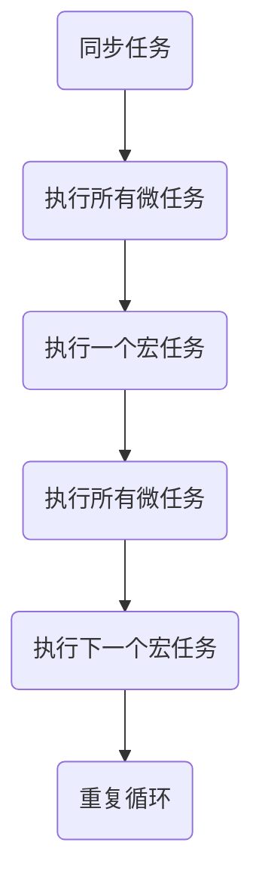
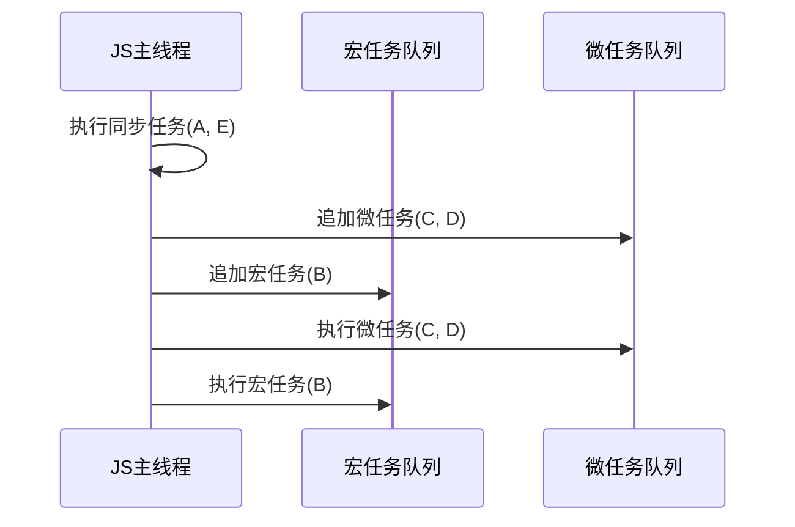

# Event loop (事件循环)

深入理解 Event Loop、宏任务和微任务

## 1. JavaScript 的执行模型

JavaScript 是 单线程 的，意味着同一时间只能执行一个任务。为了处理异步操作（如 `setTimeout`、`Promise`、`I/O` 事件等），JavaScript 采用 Event Loop（事件循环） 来管理任务执行。

## 2. 任务队列分类

JavaScript 任务分为两大类：

- 同步任务（Synchronous）：立即执行的任务，直接在主线程上运行。
- 异步任务（Asynchronous）：
  - 宏任务（Macro Task）：如 setTimeout、setInterval、setImmediate（Node.js）、MessageChannel、I/O 任务等。
  - 微任务（Micro Task）：如 Promise.then/catch/finally、MutationObserver、queueMicrotask。

🔹 区别：
微任务比宏任务优先执行，微任务队列会在当前宏任务执行完毕后，立即执行所有微任务。

## 3. Event Loop 工作流程

Event Loop 运行步骤：

1. 执行 全局同步代码（脚本任务）。
2. 遇到 异步任务，将其加入相应的 宏任务/微任务队列。
3. 同步代码执行完毕后，检查微任务队列：
    - 执行所有微任务，直到队列为空。
4. 执行一个宏任务（比如 setTimeout）。
5. 再次执行微任务队列。
6. 重复步骤 4 和 5，形成循环。

## 4. 图解 Event Loop 执行顺序

（1）任务执行流程



（2）示例代码

```js
console.log('1'); // 同步任务

setTimeout(() => {
  console.log('2'); // 宏任务
}, 0);

Promise.resolve().then(() => {
  console.log('3'); // 微任务
});

console.log('4'); // 同步任务
```

（3）执行顺序解析
表格展示了上述代码的执行顺序：

| 步骤 | 任务类型 | 代码 | 备注 |
| --- | --- | --- | --- |
| 1 | 同步任务 | `console.log('1')` | 直接执行 |
| 2 | 同步任务 | `console.log('4')` | 直接执行 |
| 3 | 微任务 | `Promise.resolve().then()` | 微任务队列执行 `console.log('3')` |
| 4 | 宏任务 | `setTimeout()` | 宏任务队列执行 `console.log('2')` |

最终输出：

```mathematica
1
4
3
2
```

📌 总结： 先执行同步代码 → 执行微任务 → 执行宏任务。

## 5. 宏任务和微任务的执行顺序

来看一个稍复杂的例子：

```js
console.log('A');

setTimeout(() => {
  console.log('B');
}, 0);

Promise.resolve().then(() => {
  console.log('C');
  return Promise.resolve();
}).then(() => {
  console.log('D');
});

console.log('E');
```

执行顺序分析

1. 同步任务执行：

   - console.log('A') → 输出 A
   - console.log('E') → 输出 E
   - Promise.then 添加到 微任务队列（C）
   - Promise.then 添加到 微任务队列（D）
   - setTimeout 添加到 宏任务队列（B）

2. 微任务执行：

    - console.log('C') → 输出 C
    - console.log('D') → 输出 D

3. 宏任务执行：

   - console.log('B') → 输出 B

最终输出：

```mathematica
A
E
C
D
B
```

## 6. Event Loop 动画示意

📌 执行顺序可视化



## 7. 实战应用

在实际开发中，我们可以利用 微任务的高优先级，让代码在更快的时间执行：

```js
setTimeout(() => console.log('setTimeout'), 0);
Promise.resolve().then(() => console.log('Promise'));
console.log('script end');
```

输出：

```arduino
script end
Promise
setTimeout
```

## 8. 重点总结

### ✅ Event Loop 执行顺序

1. 先执行同步任务（全局脚本）。
2. 遇到异步任务（宏/微任务），分别加入队列。
3. 执行所有微任务（Promise、MutationObserver）。
4. 执行一个宏任务（如 setTimeout）。
5. 继续执行微任务队列，再执行下一个宏任务。
6. 循环往复，直到任务队列为空。

### ✅ 微任务优先级高于宏任务

- Promise、MutationObserver、queueMicrotask 属于 微任务，优先执行。
- setTimeout、setInterval、I/O 任务 属于 宏任务，后执行。

## 9. 深入思考

### 📌 如何利用 Event Loop 优化性能？

- 避免长时间阻塞主线程（如 for 循环计算量大）。
- 使用 requestIdleCallback（浏览器空闲时执行）。
- 合理拆分任务，使用 微任务 来优化执行顺序。

### 📌 如何防止 UI 卡顿？

- 避免直接操作 DOM，利用 微任务（MutationObserver） 批量更新。
- 减少 setTimeout 递归调用，使用 requestAnimationFrame 优化动画性能。
