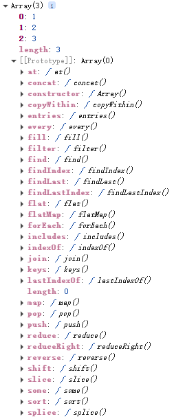
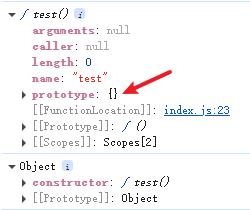
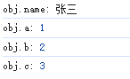
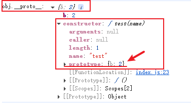

# 原形链

下面我用一个示例来说明原形链的概念。

```javascript
const arr = new Array(1, 2, 3);

console.dir(arr);
```



可以看到数组.方法() 都在它的原形链上。

## Prototype

原形 | 原形对象

1. Prototype 是【函数的】一个属性
2. Prototype 是一个对象
3. 当我们去创建函数的时候 会默认添加 Prototype 属性

> 可以记住一点 **是函数就会有 prototype(原形对象)**

```javascript
function test() {}

console.dir(test); // 查看函数的属性
console.dir(test.prototype); // 查看函数的原形对象
```



## `__proto__`

隐式原形

1. 是【对象的】一个属性
2. 指向构造函数的 prototype 属性
3. obj.`__proto__` === test.prototype true

原形链顶层 就是 `null` Object.prototype.`__proto__` === null

> 可以记住一点 **是对象就会有`__proto__`(隐式原形)**

```javascript
function test(name) {
  this.name = name;
}

const obj = new test("张三");

console.log("obj:", obj); // 查看对象的属性
console.log("obj.__proto__:", obj.__proto__); // 查看对象的隐式原形
console.log(
  "obj.__proto__ === test.prototype:",
  obj.__proto__ === test.prototype
); // true
console.log("test.prototype:", test.prototype); // 查看函数的原形对象
console.log("test.prototype.__proto__:", test.prototype.__proto__); // 查看函数的原形对象的隐式原形
console.log(
  "test.prototype.__proto__ === Object.prototype:",
  test.prototype.__proto__ === Object.prototype
); // true
console.log("Object.prototype:", Object.prototype); // 查看Object的原形对象
console.log(
  "Object.prototype.__proto__ === null:",
  Object.prototype.__proto__ === null
); // true
```

```javascript
/**
 * obj {
 *  __proto__: test.prototype = {
 *      __proto__: Object.prototype = {
 *          __proto__: null // 原型链的顶层
 *      }
 *  }
 * }
 *
 * obj是我们创建的一个对象，这个对象是通过test函数创建的。
 * 上面说了 是对象就会默认有一个__proto__属性，
 * 我们创建的这个对象obj的__proto__属性指向了test函数的prototype属性。
 * test函数的prototype属性又是一个对象，test.prototype.__proto__ -》指向了Object.prototype，
 * Object.prototype是所有对象的原型，它的__proto__属性指向null，也就是原型链的顶层。
 *
 * 这样就形成了一个原型链。
 */
```

### 原型链的查找过程

```javascript
function test(name) {
  this.name = name;
  this.a = 1;
}
const obj = new test("张三");
test.prototype.b = 2; // 给test.prototype添加一个属性b
Object.prototype.c = 3; // 给Object.prototype添加一个属性b

console.log("obj.name:", obj.name); // 输出: 张三
console.log("obj.a:", obj.a); // 输出: 1
console.log("obj.b:", obj.b); // 输出: 2 (从test.prototype上找到属性b)
console.log("obj.c:", obj.c); // 输出: 3 (从Object.prototype上找到属性c)
/**
 * obj {
 *  name: "张三",
 *  a: 1,
 *  __proto__: test.prototype = {
 *     b: 2, // test.prototype上找到了属性b
 *      __proto__: Object.prototype = {
 *          c: 3, // Object.prototype上找到了属性c
 *          toString: function() {},// Object.prototype上有toString方法
 *          hasOwnProperty: function() {},
 *          __proto__: null // 原型链的顶层
 *      }
 *  }
 * }
 */
```



可以看到没有定义在对象上的属性，都会在原型链上查找。



对象的隐式原型 `__proto__` 指向了构造函数的原型对象 `prototype`，这两个玩意儿一直在循环嵌套，但是到顶点 `null` 就结束了。

## 原型链实用案例

### 1.共享方法与属性

```javascript
function Person(name) {
  this.name = name;
}
Person.prototype.sayHello = function () {
  console.log(`Hello, my name is ${this.name}`);
};
const person1 = new Person("Alice");
const person2 = new Person("Bob");
person1.sayHello(); // 输出: Hello, my name is Alice
person2.sayHello(); // 输出: Hello, my name is Bob
console.log(person1.__proto__ === Person.prototype); // true

// 这样写的话，person1和person2都可以访问sayHello方法
// 类似于模式中的单例模式
// 通过原型链实现方法的共享
```

### 2.实现继承与多态

```javascript
function Animal(name) {
  this.name = name;
}
Animal.prototype.speak = function () {
  console.log(`${this.name} 动物的声音.`);
};
function Dog(name) {
  Animal.call(this, name); // 调用父类构造函数
}
Dog.prototype = Object.create(Animal.prototype); // 继承Animal的原型
Dog.prototype.constructor = Dog; // 修正构造函数指向
Dog.prototype.speak = function () {
  console.log(`${this.name} 汪汪叫。`);
};
const dog = new Dog("大黄");
dog.speak(); // 输出: 大黄 汪汪叫。
function Cat(name) {
  Animal.call(this, name); // 调用父类构造函数
}
Cat.prototype = Object.create(Animal.prototype); // 继承Animal的原型
Cat.prototype.constructor = Cat; // 修正构造函数指向
Cat.prototype.speak = function () {
  console.log(`${this.name} 喵喵叫.`);
};
const cat = new Cat("小猫");
cat.speak(); // 输出: 小猫 喵喵叫。
console.log(dog instanceof Animal); // true
console.log(cat instanceof Animal); // true
```

### 3.扩展内置对象功能

```javascript
Array.prototype.sum = function () {
  return this.reduce((acc, val) => acc + val, 0);
};
const arr = [1, 2, 3, 4, 5];
console.log(arr.sum()); // 输出: 15
// 通过原型链扩展了Array对象的功能
// 现在所有数组实例都可以使用sum方法
```

### 4.在框架中的应用

```javascript
class Component {
  constructor(name) {
    this.name = name;
  }
  render() {
    console.log(`Rendering ${this.name}`);
  }
}
class Button extends Component {
  constructor(name, label) {
    super(name);
    this.label = label;
  }
  render() {
    console.log(`Rendering Button: ${this.label}`);
  }
}
class Input extends Component {
  constructor(name, placeholder) {
    super(name);
    this.placeholder = placeholder;
  }
  render() {
    console.log(`Rendering Input: ${this.placeholder}`);
  }
}
const button = new Button("submitButton", "Submit");
const input = new Input("usernameInput", "Enter your username");
button.render(); // 输出: Rendering Button: Submit
input.render(); // 输出: Rendering Input: Enter your username
console.log(button instanceof Component); // true
console.log(input instanceof Component); // true
// 通过原型链实现了组件的继承和多态
// 这样可以在框架中创建各种组件，复用通用功能

// 将示例运用在实际项目中 例如：
// 在Vue或React等框架中，组件的继承和多态是非常常见的模式
```

#### 在Vue中

```javascript
// 示例 Vue.js 中的组件继承
// Vue.extend() 方法可以创建一个组件的子类，继承父组件的属性和方法
// 通过原型链实现组件的继承和多态
// 例如：
Vue.component("BaseButton", {
  template: "<button>{{ label }}</button>",
  props: ["label"]
});
Vue.component("PrimaryButton", {
  extends: Vue.component("BaseButton"),
  data() {
    return {
      label: "Primary Button"
    };
  },
  methods: {
    clickHandler() {
      console.log("Primary button clicked");
    }
  }
});
```

#### 在React中

```javascript
// 在React中也有类似的组件继承和多态的实现方式
// 例如：
class BaseButton extends React.Component {
  render() {
    return <button>{this.props.label}</button>;
  }
}
class PrimaryButton extends BaseButton {
  constructor(props) {
    super(props);
    this.state = { label: "Primary Button" };
  }
  clickHandler() {
    console.log("Primary button clicked");
  }
  render() {
    return (
      <button onClick={() => this.clickHandler()}>{this.state.label}</button>
    );
  }
}
// 在实际项目中，原型链的应用非常广泛，尤其是在面向对象编程和组件化开发中。
```

> 总之，原型链通过实现属性和方法的共享与继承，极大地提高了代码的复用性和扩展性，但在使用时需注意避免原型污染和过长的原型链导致的性能问题。
