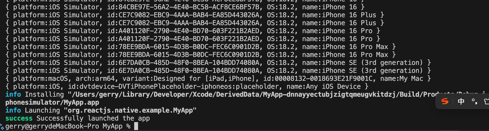
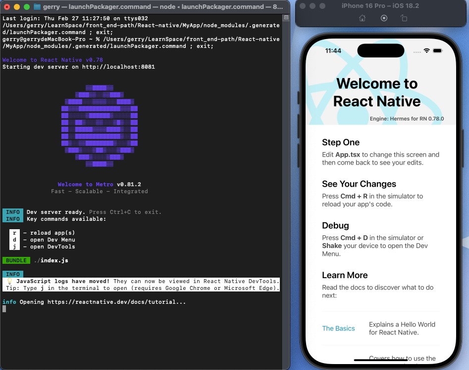
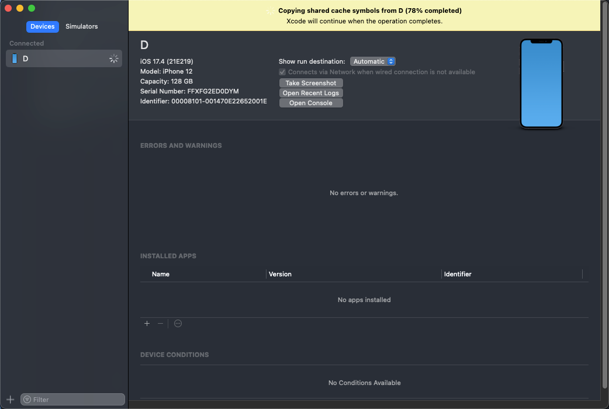

# **`react-native` 项目搭建**  

`React Native` 是 Facebook 推出的一套跨平台移动应用开发框架，可以使用 React 的语法开发 iOS 和 Android 应用，下面是 React Native 的开发流程：

## 1. 环境搭建

✅ 安装必要的工具

1. Node.js（推荐 LTS 版本）

    下载并安装：[Node.js 官网](https://nodejs.org/)

2. Yarn（推荐） 或 npm

    ```bash
    npm install -g yarn
    ```

3. Expo CLI（可选）

    ```bash
    npm install -g expo-cli
    ```

4. Android Studio / Xcode（运行模拟器）

    - [Android Studio 下载](https://developer.android.com/studio)
    - [Xcode 下载](https://developer.apple.com/xcode/)

    1. iOS 需要 macOS 并安装 Xcode

    2. Android 需要安装 Android Studio，并配置 `Android SDK` 以及 `ANDROID_HOME` 环境变量

## 2. 创建项目

✅ 方式 1：使用 Expo CLI（适合快速开发）

```bash
expo init my-app
cd my-app
expo start
```

- 优点：无需配置 Android / iOS 依赖，适合小型应用和初学者。
- 缺点：不支持某些原生模块，需要 eject 才能使用原生代码。

::: warning 已废弃
此代码已废弃，不建议使用：

✅ 方式 2：使用 React Native CLI（适合大型应用）

```bash
npx react-native init my-app
cd my-app
npx react-native run-android # 运行 Android
npx react-native run-ios # 运行 iOS（需要 macOS）
```

:::

React Native 官方已废弃 `npx react-native init` 命令，现在推荐使用以下方式创建新项目：

✅ 方式 2：使用 @react-native-community/cli（推荐）

```bash
npx @react-native-community/cli init MyApp
```

如果你已经使用 @react-native-community/cli 初始化了 React Native 项目，接下来你可以按照以下步骤在 iOS 模拟器上运行它。

🛠 1. 进入项目目录

```bash
cd MyApp
```

📦 2. 安装 iOS 依赖

```bash
npx pod-install
```

⚠️ 注意：如果你没有安装 CocoaPods，你可以通过以下命令安装：

```bash
sudo gem install cocoapods
```

说明：这个命令会自动启动 iOS 模拟器并在其中运行你的 React Native 应用。
:::

- 优点：完全原生，适用于大型应用开发。
- 缺点：需要手动配置环境，如 Android Studio 和 Xcode。

## 3. 运行项目

✅ Expo

```bash
expo start # 运行开发服务器
```

- 扫描 QR 码，在手机 Expo Go App 运行应用。

✅ React Native CLI

```bash
npx react-native run-android # 运行 Android
npx react-native run-ios # 运行 iOS（需要 macOS）
```

- 运行模拟器或连接真机运行应用。

> **我这里运行的 ios 模拟器**

### **运行过程中遇到的问题：**

```bash
TypeError [ERR_INVALID_CHAR]: Invalid character in header content ["X-React-Native-Project-Root"]
```

**错误说明：**

Metro Bundler 在构建请求头时，项目路径中包含了无效字符，导致 X-React-Native-Project-Root 头部值非法。你可以尝试以下几种解决方案：

- 检查项目路径

    确保项目的根目录路径中没有特殊字符或空格。例如：

  - 避免中文或其他非 ASCII 字符
  - 避免特殊符号（如 @、#、$ 等）

    如果当前路径存在这些字符，可以尝试将项目移动到一个简单的路径下

正常情况：

运行完 `npx react-native run-ios` 命令后，会自动打开模拟器，并在模拟器上运行 React Native 项目。同时会启动metro bundler 服务，如下图所示：





### 连接真实设备

1. 用 USB 连接 iPhone 或 iPad 到你的 Mac(iphone需要打开 隐私与安全性-> 开发者模式)。
2. 打开 Xcode：

   - Window → Devices and Simulators
   - 选择 你的设备，等待它完成初始化。
   
3. 回到 Xcode 项目：

   - 选择 Signing & Capabilities 选项卡。
   - 勾选 Automatically manage signing(自动管理签名)。
   - 确保 Development Team 正确（你的 Apple ID）。

4. 重新运行：

```bash
npx react-native run-ios --device "你的设备名"
```

运行失败：

```bash
...
error Failed to install the app on the device because we couldn't execute the "ios-deploy" command. Please install it by running "brew install ios-deploy" and try again.
```

`ios-deploy` 依赖未安装.

✅ 1. 安装 ios-deploy

```bash
brew install ios-deploy
```

```bash
ios-deploy --version
```

✅ 2. 清理 Pods 并重新构建

```bash
cd ios
rm -rf Pods Podfile.lock build
pod install --verbose
cd ..
```

然后再次运行：

```bash
npx react-native run-ios --device "你的设备名"
```

## 4. 项目结构

通常的 React Native 项目结构如下：

```bash
MyApp/
├── android/          # 原生 Android 代码
├── ios/              # 原生 iOS 代码
├── src/              # 主要业务逻辑代码
│   ├── components/   # 可复用组件
│   ├── screens/      # 页面（Screen）
│   ├── navigation/   # 路由（React Navigation）
│   ├── redux/        # 状态管理（Redux 可选）
│   ├── assets/       # 图片、图标等资源
│   ├── utils/        # 工具函数
│   ├── App.tsx       # 入口文件
├── package.json      # 依赖管理
├── babel.config.js   # Babel 配置
├── metro.config.js   # Metro 打包工具配置
├── tsconfig.json     # TypeScript 配置
```

## 5. UI 组件开发

React Native 提供了一些基础组件，例如：

- `View`：类似 `div`，用于布局
- `Text`：文本
- `Image`：图片
- `ScrollView`：滚动视图
- `FlatList`：列表
- `TouchableOpacity`：可点击组件
- `TextInput`：输入框
- `StyleSheet`：样式表

```tsx
import React from 'react';
import { View, Text, Button, Alert } from 'react-native';

const App = () => {
  return (
    <View style={{ flex: 1, justifyContent: 'center', alignItems: 'center' }}>
      <Text>Hello, React Native!</Text>
      <Button title="点击我" onPress={() => Alert.alert('按钮被点击')} />
    </View>
  );
};

export default App;
```

## 6. 路由管理

✅ React Navigation（推荐）

安装：

```bash
npm install @react-navigation/native @react-navigation/stack
npm install react-native-gesture-handler
npm install react-native-screens react-native-safe-area-context react-native-gesture-handler react-native-reanimated react-native-vector-icons
```

安装后重新构建App：

```bash
npx react-native run-ios
```

使用：

```tsx
import 'react-native-gesture-handler';
import React from 'react';
import { NavigationContainer } from '@react-navigation/native';
import { createStackNavigator } from '@react-navigation/stack';
import { RootStackParamList } from './types'; // 确保这里的路径正确
import HomeScreen from './screens/HomeScreen';
import DetailsScreen from './screens/DetailsScreen';

const Stack = createStackNavigator<RootStackParamList>();

function App(): React.JSX.Element {

  return (
    <NavigationContainer>
    <Stack.Navigator>
      <Stack.Screen name="Home" component={HomeScreen} />
      <Stack.Screen name="Details" component={DetailsScreen} />
    </Stack.Navigator>
  </NavigationContainer>
  );
}

export default App;
```

```tsx
// types.ts
export type RootStackParamList = {
  Home: undefined;
  Details: undefined;
};
```

```tsx
// screens/HomeScreen.tsx
import React, { useCallback } from 'react';
import { View, Text, Button, StyleSheet } from 'react-native';
import { useNavigation } from '@react-navigation/native';
import { StackNavigationProp } from '@react-navigation/stack';
import { RootStackParamList } from '../types';

type HomeScreenNavigationProp = StackNavigationProp<RootStackParamList, 'Home'>;

const HomeScreen = () => {
  const navigation = useNavigation<HomeScreenNavigationProp>();

  const toDetails = useCallback(() => {
    navigation.navigate('Details');
  }, [navigation]);

  return (
    <View style={styles.container}>
      <Text style={styles.title}>Home Screen</Text>
      <Button title="Go to Details" onPress={toDetails} />
    </View>
  );
};

const styles = StyleSheet.create({
  container: {
    flex: 1,
    justifyContent: 'center',
    alignItems: 'center',
  },
  title: {
    fontSize: 24,
    fontWeight: 'bold',
    marginBottom: 20,
  },
});

export default HomeScreen;
```

```tsx
// screens/DetailsScreen.tsx
import React from 'react';
import { StyleSheet, Text, View } from 'react-native';

const styles = StyleSheet.create({
    container: {
        flex: 1,
        alignItems: 'center',
        justifyContent: 'center',
    },
    title: {
        fontSize: 20,
        fontWeight: 'bold',
    },
});

const DetailsScreen = () => {
    return (
        <View style={styles.container}>
            <Text style={styles.title}>
                Details Screen
            </Text>
        </View>
    );
}

export default DetailsScreen;
```

## 7. 状态管理

✅ 使用 Redux（适用于复杂应用）

运行以下命令安装 Redux Toolkit 和 React-Redux：

```bash
npm install @reduxjs/toolkit react-redux
```

为什么用 `@reduxjs/toolkit`？

- 简化 Redux 开发（不需要手写 `actions` 和 `reducers`）
- 内置 `immer.js`（可以直接修改 `state`）
- 支持异步 `createAsyncThunk`

1️⃣ 配置 Redux Store

在 redux/store.ts 里配置 Redux store：

```tsx
// redux/store.ts
import {configureStore} from '@reduxjs/toolkit';

import counterReducer from './CounterSlice';

export const store = configureStore({
  reducer: {
    counter: counterReducer,
  },
});

export type RootState = ReturnType<typeof store.getState>;
export type AppDispatch = typeof store.dispatch;
```

在 ./src/App.tsx 里，使用 Provider 绑定 store：

```tsx
// App.tsx
import { Provider } from 'react-redux';
import {store} from './redux/store';
// ...

const App = () => {
  return (
    <Provider store={store}>
      <NavigationContainer>
        ...
      </NavigationContainer>
    </Provider>
  );
};
```

2️⃣ 创建 Slice（状态管理）

在 redux/counterSlice.ts 里：

```tsx
// redux/CounterSlice.ts
import {createSlice, PayloadAction} from '@reduxjs/toolkit';

interface CounterState {
  value: number;
}

const initialState: CounterState = {
  value: 0,
};

const counterSlice = createSlice({
  name: 'counter',
  initialState,
  reducers: {
    increment: state => {
      state.value += 1;
    },
    decrement: state => {
      state.value -= 1;
    },
    fdexp: (state, action: PayloadAction<number>) => {
      state.value += action.payload;
    },
  },
});

export const {increment, decrement,fdexp} = counterSlice.actions;
export default counterSlice.reducer;
```

3️⃣ 使用 Redux useSelector & useDispatch

在 screens/HomeScreen.tsx 里：

```tsx
// screens/HomeScreen.tsx
import { useDispatch, useSelector } from 'react-redux';
import { RootState } from '../redux/store';
import { increment, decrement,fdexp } from '../redux/CounterSlice';

// ...

const HomeScreen = () => {
  const dispatch = useDispatch();
  const count = useSelector((state: RootState) => state.counter.value);

  // ...

  return (
    <View style={styles.container}>
      {/* ... */}
      <Text>{count}</Text>
      <TouchableOpacity >
        <Button title={'点击+1'} onPress={()=>dispatch(increment())} />
      </TouchableOpacity>
      <TouchableOpacity  >
        <Button title={'点击-1'}  onPress={()=>dispatch(decrement())}/>
      </TouchableOpacity>

      <TouchableOpacity  >
        <Button title={'乘积'}  onPress={()=>dispatch(fdexp(count))}/>
      </TouchableOpacity>
    </View>
  );
};
```

## 8. 网络请求

✅ 使用 `fetch` API

```tsx
useEffect(() => {
  fetch('https://jsonplaceholder.typicode.com/posts/1')
    .then(response => response.json())
    .then(data => console.log(data));
}, []);
```

✅ 使用第三方库 `axios`

```bash
npm install axios
```

```tsx
import axios from 'axios';

useEffect(() => {
  axios.get('https://jsonplaceholder.typicode.com/posts/1')
    .then(response => console.log(response.data));
}, []);
```

### 1. 创建 Axios 封装

在 src/api/apiClient.ts 中，封装 Axios 实例：

```ts
// api/apiClient.ts
import axios from 'axios';

// 创建 Axios 实例
const apiClient = axios.create({
  baseURL: 'https://jsonplaceholder.typicode.com', // 你的 API 地址
  timeout: 10000,
  headers: {
    'Content-Type': 'application/json',
  },
});

// 添加请求拦截器（比如添加 Token）
apiClient.interceptors.request.use(
  config => {
    // 这里可以动态添加 Token
    const token = 'your-auth-token'; // 从 Redux 或 AsyncStorage 获取 Token
    if (token) {
      config.headers.Authorization = `Bearer ${token}`;
    }
    return config;
  },
  error => {
    return Promise.reject(error);
  },
);

// 添加响应拦截器（全局错误处理）
apiClient.interceptors.response.use(
  response => response,
  error => {
    console.error('API Error:', error.response?.data || error.message);
    return Promise.reject(error);
  },
);

export default apiClient;
```

✨ 这样封装的 Axios：

- ✅ 自动添加 Token

- ✅ 统一错误处理

- ✅ 支持全局配置 baseURL

### 2. 创建用户 API 请求

在 src/api/counter.ts 中：

```tsx
// api/counterApi.ts
import apiClient from './apiClient';

/**
 * 获取用户数据
 * @param id 用户 ID
 * @returns
 */
export const fetchUserData = async (id: number) => {
  const response = await apiClient.get(`/posts/${id}`);
  return response.data;
};
```

✨ 这样可以避免组件中直接调用 axios，提高代码复用性！

### 3. **配合 Redux 使用：** 在 Redux Slice 里使用 API

```tsx
// api/counterApi.ts
import { createAsyncThunk } from '@reduxjs/toolkit';
import axios from 'axios';

export const fetchPost = createAsyncThunk(
  'post/fetchPost',
  async () => {
    const response = await axios.get('https://jsonplaceholder.typicode.com/posts/1');
    return response.data;
  }
);
```

- **创建异步 Thunk**

在 src/redux/counterSlice.ts：

```tsx
// redux/CounterSlice.ts
import {fetchUserData} from '../api/counter';

export type UserDto = {
  id: number;
  userId: number;
  title: string;
  body: string;
};

export interface CounterState {
  value: number;
  user: UserDto;
  loading: boolean;
  error?: string;
}

const initialState: CounterState = {
  value: 0,
  user: {
    id: 0,
    userId: 0,
    title: '',
    body: '',
  },
  loading: false,
  error: undefined,
};

// 创建异步 Thunk
export const fetchUser = createAsyncThunk(
  'user/fetchUser',
  async (id: number) => {
    return await fetchUserData(id);
  },
);

const counterSlice = createSlice({
  name: 'counter',
  initialState,
  reducers: {
    // ...
  },
  extraReducers: builder => {
    builder
      .addCase(fetchUser.pending, (state, action) => {
        // TODO 你可以在这里处理 pending 状态
        console.log('pending', state, action);
        state.loading = true;
        state.error = undefined;
      })
      .addCase(fetchUser.fulfilled, (state, action) => {
        state.loading = false;
        state.user = action.payload;
      })
      .addCase(fetchUser.rejected, (state, action) => {
        // TODO 处理 rejected 状态
        console.log('rejected', state, action);
        state.loading = false;
        state.error = action.error.message || '加载失败';
      });
  },
});

//...
```

### 4. 在组件中使用 Redux API

在 screens/DetailsScreen.tsx 中：

```tsx
// screens/DetailsScreen.tsx
import React, {useEffect} from 'react';
import {StyleSheet, Text, View} from 'react-native';
import {fetchUser} from '../redux/CounterSlice';
import {useDispatch, useSelector} from 'react-redux';
import {AppDispatch, RootState} from '../redux/store';

const styles = StyleSheet.create({
 // ...
});

const DetailsScreen = () => {
  const dispatch = useDispatch<AppDispatch>();
  const user = useSelector((state: RootState) => state.counter.user);

  useEffect(() => {
    dispatch(fetchUser(1));
  }, [dispatch]);

  return (
    <View style={styles.container}>
      <Text style={styles.title}>id- {user.id}</Text>
      <Text style={styles.title}>userId- {user.userId}</Text>
      <Text style={styles.title}>title- {user.title}</Text>
      <Text style={styles.title}>body- {user.body}</Text>
    </View>
  );
};

export default DetailsScreen;
```

## 9. 发布应用

✅ Expo

```bash
expo build:android # 构建 Android 应用
expo build:ios # 构建 iOS 应用
```

- 通过 Expo 服务构建应用，无需配置签名等。
- 也可以使用 `expo publish` 更新应用。
- [Expo 文档](https://docs.expo.dev/distribution/introduction/)
- [Expo Go App](https://expo.dev/client)
- [Expo DevTools](https://expo.dev/tools)

✅ React Native CLI

- ✅ Android 打包

```bash
cd android
./gradlew assembleRelease
```

- 生成 APK 文件：`android/app/build/outputs/apk/release/app-release.apk`
- [Android 打包文档](https://reactnative.dev/docs/signed-apk-android)
- [Android 签名文档](https://developer.android.com/studio/publish/app-signing)
- [Google Play Console](https://play.google.com/console)
- [Google Play 发布指南](https://developer.android.com/distribute/play-console)
- [Google Play 签名 APK](https://developer.android.com/studio/publish/app-signing)
- [Google Play App Bundle](https://developer.android.com/guide/app-bundle)

- ✅ iOS 打包

```bash
cd ios
xcodebuild -workspace MyApp.xcworkspace -scheme MyApp -sdk iphoneos -configuration AppStoreDistribution archive
```

- 生成 `MyApp.xcarchive` 文件
- [iOS 打包文档](https://reactnative.dev/docs/running-on-device)
- [App Store Connect](https://appstoreconnect.apple.com/)
- [App Store Connect 文档](https://developer.apple.com/support/app-store-connect/)
- [App Store Connect 上架指南](https://developer.apple.com/app-store/submissions/)
- [App Store Connect 上传 App](https://developer.apple.com/app-store/submissions/)
- [App Store Connect 上传 App 预览](https://developer.apple.com/app-store/submissions/app-previews-and-screenshots/)
- [App Store Connect 上传 App 元数据](https://developer.apple.com/app-store/submissions/app-metadata/)

## 10. 调试工具

✅ 使用 React Native Debugger

```bash
brew install --cask react-native-debugger
```

然后在 Chrome DevTools 进行调试。

✅ 使用 Flipper（React Native 官方调试工具）

```bash
brew install --cask flipper

```

可以查看日志、性能监控、Redux 状态等。

## 总结

1️⃣ 环境搭建（Node.js、Android Studio、Xcode）

2️⃣ 创建项目（Expo 或 React Native CLI）

3️⃣ 开发 UI 组件（View、Text、Image、ScrollView）

4️⃣ 实现路由（React Navigation）

5️⃣ 管理状态（useState、Redux）

6️⃣ 处理网络请求（fetch、axios）

7️⃣ 打包发布（Android、iOS）

8️⃣ 调试优化（React Native Debugger、Flipper）

React Native 适合跨平台开发，节省开发成本，推荐用于 App 快速迭代 🚀！
