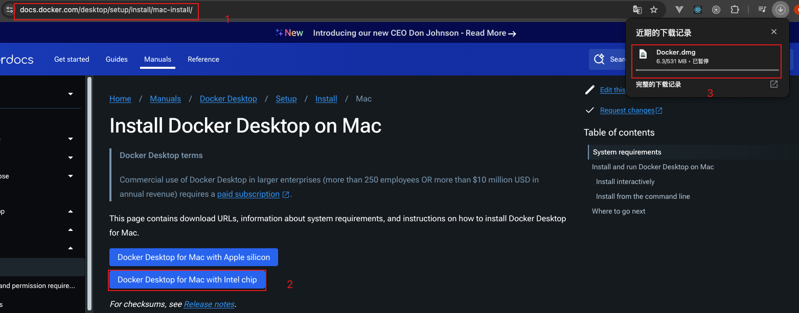

# docker

## 1. 安装docker

<https://docs.docker.com/desktop/setup/install/mac-install/>



或者通过 `Home brew` 安装

```shell
brew install --cask docker
```

查看docker版本

在运行这条命令时 会验证docker应用 并记录到应用程序中

```shell
docker -v
```

显示如下信息表示没有配置环境变量

```shell
zsh: command not found: docker
```

配置环境变量

```shell
export PATH="$PATH:/Applications/Docker.app/Contents/Resources/bin/"
```

查看docker版本

```shell
docker -v
```

显示如下信息表示安装成功

```shell
Docker version 27.5.1, build 9f9e405
```

## 2. 找不到 `docker` 命令

如果在终端中输入 `docker` 命令后，提示找不到命令，可以尝试以下方法：

### 1. 确保 Docker 已安装

🔹 方法 1：检查 Docker 是否安装

打开终端，输入以下命令：

```shell
which docker
```

如果返回：

```shell
/usr/local/bin/docker
```

则表示 Docker 已安装。

如果返回：

```shell
docker not found
```

则表示 Docker 未安装。

[见方法3](#3-修复-path-变量)

### 2. 安装或重新安装 Docker

🔹 方法 1：使用 Homebrew 安装

1. 卸载旧版本（如果有）

    ```shell
    brew uninstall --cask docker
    ```

2. 安装 Docker

    ```shell
    brew install --cask docker
    ```

3. 启动 Docker

    ```shell
    open /Applications/Docker.app
    ```

4. 启动完成后运行以下命令

    ```shell
    docker -v
    ```

    如果显示 Docker 版本信息，则表示安装成功。

### 3. 修复 PATH 变量

如果 `docker` 已安装但无法找到，可能是 `PATH` 变量缺少 `/usr/local/bin`。

🔹 方法 1：添加 Docker 到 PATH

1. 找到 Docker 安装路径

    ```sh
    find / -name docker 2>/dev/null
    ```

    如果返回类似：

    ```sh
    /usr/local/bin/docker
    /Applications/Docker.app/Contents/Resources/bin/docker
    ```

2. 手动添加 Docker 到 PATH

    ```sh
    echo 'export PATH="/usr/local/bin:$PATH"' >> ~/.zshrc
    source ~/.zshrc

    ```

    或

    ```sh
    export PATH="$PATH:/Applications/Docker.app/Contents/Resources/bin/"
    ```

    然后再次运行 `docker -v` 检查是否成功。
