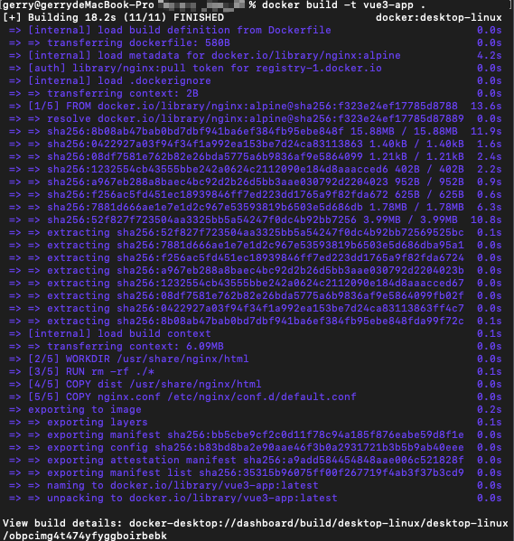
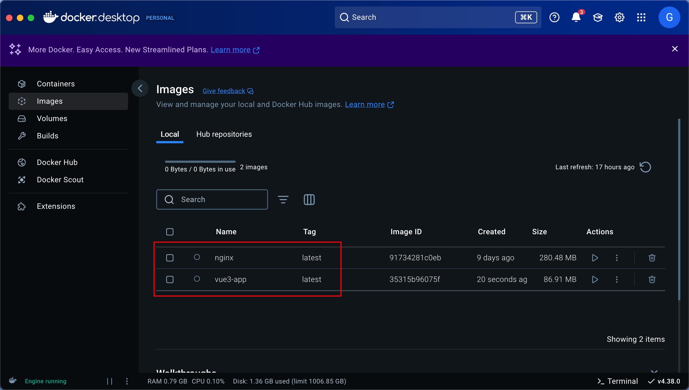
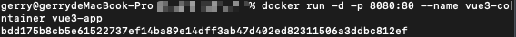
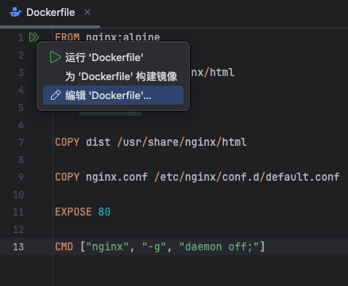
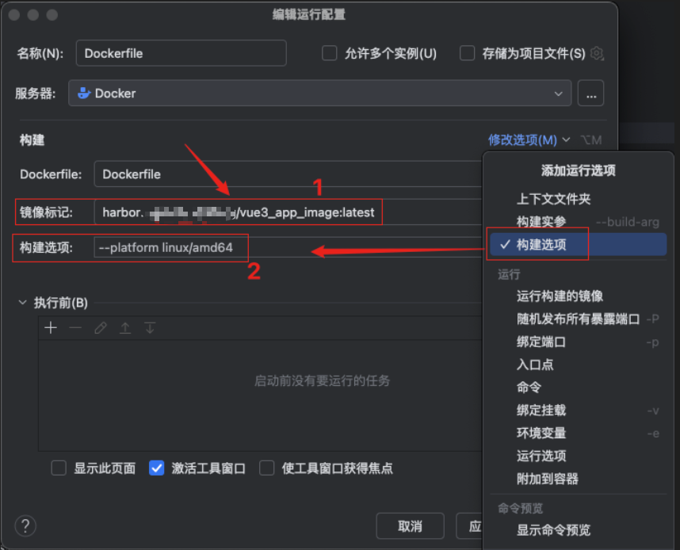

# Vue3 项目打包成 docker 镜像部署

## 1. 确保环境准备

- 本地开发环境
  - Vue3 + Vite
  - Docker 已安装（[点击这里查看 docker 安装](./guide.md)）
  - Docker Compose（可选）
- 服务器环境
  - 服务器已安装 Docker & Docker Compose
  - 域名

确保 docker desktop 已安装启动

```shell
docker -v
```

## 2. 项目打包

```shell
pnpm run build
```

生成 `dist` 目录

## 3. Dockerfile

在项目根目录下创建 `Dockerfile` 文件

```dockerfile
# 1️⃣ 使用官方 Nginx 作为基础镜像
FROM nginx:alpine

# 2️⃣ 设定工作目录（Nginx 默认存放前端文件的位置）
WORKDIR /usr/share/nginx/html

# 3️⃣ 删除默认的 Nginx 页面
RUN rm -rf ./*

# 4️⃣ 复制 Vue 3 打包后的 `dist` 目录到容器中
COPY dist /usr/share/nginx/html

# 5️⃣ 复制 Nginx 配置文件
COPY nginx.conf /etc/nginx/conf.d/default.conf

# 6️⃣ 暴露 Nginx 端口
EXPOSE 80

# 7️⃣ 启动 Nginx
CMD ["nginx", "-g", "daemon off;"]
```

**✅ 解释**

- `FROM nginx:alpine`：使用 轻量级 `Nginx` 作为基础镜像
- `Copy dist /usr/share/nginx/html`：将 Vue 3 打包后的 `dist` 目录复制到 `Nginx` 容器中
- `COPY nginx.conf /etc/nginx/conf.d/default.conf`：复制 Nginx 配置文件
- `EXPOSE 80`：暴露 Nginx 端口
- `CMD ["nginx", "-g", "daemon off;"]`：启动 Nginx

## 4. Nginx 配置文件

在项目根目录下创建 `nginx.conf` 文件

```nginx
server {
    listen 80;
    server_name localhost;

    location / {
        root   /usr/share/nginx/html;
        index  index.html;
        try_files $uri /index.html;
    }

    error_page   500 502 503 504  /50x.html;
    location = /50x.html {
        root   /usr/share/nginx/html;
    }
}

```

**✅ 解释**

- `try_files $uri /index.html;`：解决 Vue Router 刷新页面 404 的问题

### 4.1. 添加 API 代理

如果 Vue 3 项目需要访问后端 API，可以在 Nginx 配置文件中添加 API 代理：

```nginx
server {
    listen 80;
    server_name localhost;

    # 代理 API 请求到后端服务器
    location /api/ {
        proxy_pass https://your-api-server.com/;
        proxy_set_header Host $host;
        proxy_set_header X-Real-IP $remote_addr;
        proxy_set_header X-Forwarded-For $proxy_add_x_forwarded_for;
        proxy_set_header X-Forwarded-Proto $scheme;

        # 解决 CORS 预检请求
        add_header Access-Control-Allow-Origin *;
        add_header Access-Control-Allow-Methods "GET, POST, OPTIONS, PUT, DELETE";
        add_header Access-Control-Allow-Headers "Authorization, Content-Type";
        if ($request_method = OPTIONS) {
            return 204;
        }
    }

    location / {
        root   /usr/share/nginx/html;
        index  index.html;
        try_files $uri /index.html;
    }

    error_page 500 502 503 504 /50x.html;
    location = /50x.html {
        root /usr/share/nginx/html;
    }
}
```

**✅ 解释**

- `location /api/`：代理 API 请求到后端服务器
- `proxy_pass https://your-api-server.com/`：将 API 请求转发到后端服务器
- `proxy_set_header`：转发请求头信息，保持用户信息
- `add_header Access-Control-Allow-Origin *;`：解决 CORS 跨域问题
- `if ($request_method = OPTIONS) { return 204; }`：解决 CORS 预检请求

## 5. 构建 Docker 镜像

打开终端进入项目根目录，执行以下命令：

```shell
docker build -t vue3-app .
```



执行完成后，会生成一个名为 `vue3-app` 的 Docker 镜像 以及 `nginx` 镜像



**✅ 解释**

- `-t vue3-app`：指定镜像名称为 `vue3-app`
- `.`：表示当前目录的 `Dockerfile` 进行构建

## 6. 运行 Docker 容器

```shell
docker run -d -p 8080:80 --name vue3-container vue3-app
```

**✅ 解释**

- `-d`：后台运行
- `-p 8080:80`：将容器的 80 端口映射到宿主机的 8080 端口
- `--name vue3-container`：指定容器名称为 `vue3-container`
- `vue3-app`：使用 `vue3-app` 镜像

运行完成后，可以看到 `vue3 app` 镜像已经运行在使用中：




## 7. 访问 Vue 3 应用

打开浏览器，访问：

```arduino
http://localhost:8080
```

如果是服务器部署，使用服务器 IP 地址：

```arduino
http://服务器IP:8080
```

## 8. 部署到服务器

### 8.1. 上传 Docker 镜像 和 dist 文件夹

使用 `scp` 命令上传 Docker 镜像和 `dist` 文件夹到服务器

```sh
scp -r ./dist Dockerfile nginx.conf user@your-server-ip:/home/user/vue3-app
```

### 8.2. 在服务器上构建 Docker 镜像

```sh
cd /home/user/vue3-app
docker build -t vue3-docker .
```

### 8.3. 运行 Docker 容器

```sh
docker run -d -p 80:80 --name vue3-container vue3-docker
```

然后，就可以使用 <http://your-server-ip> 访问 Vue 3 站点了！🚀

## 9. 使用 Docker Compose 部署（可选）

### 9.1. 创建 `docker-compose.yml` 文件

在项目根目录下创建 `docker-compose.yml` 文件

```yml
version: "3"
services:
  vue-app:
    build: .
    container_name: vue3-container
    ports:
      - "8080:80"
    restart: always
```

### 9.2. 运行 Docker Compose

```sh
docker-compose up -d
```

## 10. 常见问题 & 解决方案

### 10.1. Vue Router 刷新页面 404

在 Nginx 配置文件中添加以下配置：

```nginx
location / {
    try_files $uri /index.html;
}
```

然后，重新构建 Docker 镜像：

```sh
docker restart vue3-container
```

### 10.2. Nginx 端口占用

如果 Nginx 端口被占用，可以使用以下命令查看端口占用情况：

```sh
lsof -i:80
```

然后，使用 `kill` 命令杀死进程：

```sh
kill -9 PID
```

### 10.3. Docker 镜像无法构建

如果 Docker 镜像无法构建，可以尝试以下解决方案：

- 检查 Dockerfile 文件是否正确
- 检查 Nginx 配置文件是否正确
- 检查 Vue 3 打包后的 `dist` 目录是否正确

## 11. 本地推送更新到容器仓库

```shell
docker push harbor.example.com/vue3-app:latest
```

## 12. DevOpes 自动化部署

### 管道流程任务

1. 使用 Node.js 生态系统 版本 20.x
2. `npm install -g pnpm` 安装 pnpm
3. `pnpm install` 安装依赖
4. `pnpm run build` 打包项目
5. 复制 dist 文件到发布目录
6. 复制 nginx.conf 文件到发布目录
7. 复制 Dockerfile 文件到发布目录
8. 发布项目

### 发布流程

#### 新建发布管道

- 项目区域

  1. 源类型 Build
  2. 选择项目
  3. 选择管道源

- 阶段区域

  1. 添加阶段 选择 Azure 应用服务部署
  2. 查看阶段任务

     - 在代理任务上点击+号 搜索 `Docker`

       1. `docker login` 登录容器仓库

          - 显示名称 `Login`
          - 容器注册表 `harbor.example.com`
          - 命令 `login`
          - 将管道元数据添加到映像
          - 将基本映像元数据添加到映像

       2. 构建&推送(buildAndPush)镜像

          - 显示名称 `buildAndPush`
          - 容器注册表 `harbor.example.com`
          - 容器存储库 `vue3-app`
          - 命令选择 `buildAndPush`
          - 填写 `Dockerfile`文件路径
          - 填写 `Context` 上下文路径（就是资源文件路径 例如：/dist）
          - 将管道元数据添加到映像
          - 将基本映像元数据添加到映像

## 将静态项目打包成 docker 镜像推送至 harbor 仓库

### 📌 1. 确保你的静态页面目录结构

你的 静态文件夹 目录结构应类似于：

```shell
/my-static-site
│── index.html
│── static/
│   ├── app.js
│   ├── style.css
│── images/
│── nginx.conf
│── Dockerfile
```

### 📌 2. 创建 `Dockerfile`

在 `my-static-site` 目录 下创建 `Dockerfile`：

```dockerfile
# 1️⃣ 使用官方 Nginx 作为基础镜像
FROM nginx:alpine

# 2️⃣ 设定工作目录（Nginx 默认存放前端文件的位置）
WORKDIR /usr/share/nginx/html

# 3️⃣ 删除默认的 Nginx 页面
RUN rm -rf ./*

# 4️⃣ 复制当前目录下的静态文件到 Nginx 的 web 根目录
COPY . /usr/share/nginx/html

# 5️⃣ 复制 Nginx 配置文件（确保你有 `nginx.conf`）
COPY nginx.conf /etc/nginx/conf.d/default.conf

# 6️⃣ 暴露 80 端口
EXPOSE 80

# 7️⃣ 启动 Nginx
CMD ["nginx", "-g", "daemon off;"]
```

### 📌 3. 创建 `nginx.conf`

如果你需要 自定义 Nginx 配置（例如 支持 SPA 或 API 代理），创建 `nginx.conf`：

```nginx
server {
    listen 80;
    server_name localhost;

    location / {
        root /usr/share/nginx/html;
        index index.html;
        try_files $uri $uri/ /index.html;
    }
}
```

### 📌 4. 构建 Docker 镜像

在 `my-static-site` 目录下，执行以下命令：

```shell
docker build --platform linux/amd64 -t my-static-site .
```

**解释：**

- `--platform linux/amd64`：指定镜像平台为 `linux/amd64`
- `-t my-static-site`：指定镜像名称为 `my-static-site`
- `.`：表示当前目录的 `Dockerfile` 进行构建

### 📌 5. 运行 Docker 容器

```shell
docker run -d -p 8080:80 --name static-site my-static-site
```

### 📌 6. 访问静态页面

打开浏览器，访问：

```shell
http://localhost:8080
```

### 📌 6. 登录 Harbor 并推送镜像

如果还未登录 Harbor，可以使用以下命令登录：

```shell
docker login harbor.yourcompany.com
```

创建 tag 并推送镜像

```shell
docker tag my-static-site harbor.yourcompany.com/library/my-static-site:latest
docker push harbor.yourcompany.com/library/my-static-site:latest

```

## 使用 WebStorm 推送 docker 镜像到 Harbor

前置条件：

1. 构建 dockerk 镜像

```shell
docker build -t vue3-app .
```

2. 构建后可以摘 docker desktop 查看镜像是否构建成功

### 1. 打开 WebStorm

拉取项目分支代码到最新

```shell
git pull origin master
```

打包 vue 项目

```shell
pnpm run build
```

### 2. 打开 Docker 文件

```dockerfile
# 使用官方 Nginx 作为基础镜像
FROM nginx:alpine
# 设定工作目录（Nginx 默认存放前端文件的位置）
WORKDIR /usr/share/nginx/html
# 删除默认的 Nginx 页面
RUN rm -rf ./*
# 复制 Vue 3 打包后的 dist 目录到容器中
COPY dist /usr/share/nginx/html
# 复制 Nginx 配置文件
COPY nginx.conf /etc/nginx/conf.d/default.conf
# 暴露 Nginx 端口
EXPOSE 80
# 启动 Nginx
CMD ["nginx", "-g", "daemon off;"]
```



### 3. 构建 Docker 镜像



编辑构建镜像的选项 填写命令

1. 镜像标记：

```
harbor.自己的域名.com/cg/vue3_app_image:latest
```

2. 构建选项

```
--platform linux/amd64
```

3. Dockerfile 路径

选择项目中的 `Dockerfile` 文件

4. 应用(A)

### 4. 构建镜像

运行即可


### 5. 登录你的镜像管理台（如 Harbor）

```
docker login harbor.自己的域名.com
```

### 6. 推送镜像到 Harbor

```shell
docker push harbor.自己的域名.com/cg/vue3_app_image:latest
```
